# ATS Optimizer — Documentation Hub

> **A fully-automated job application pipeline built for people who don't have time to job-hunt.**

---

## Who This Is For

| Persona | Pain Point |
|---|---|
| **Jobless candidate** | Applying to 50+ jobs/day manually is exhausting and demoralizing |
| **Toxic-job survivor** | No time or energy after work to search, tailor, apply |
| **Career switcher** | Needs resumes rewritten for every new domain |

The system eliminates **every manual step** between "I'm looking for a job" and "application submitted."

---

## How It Works (30-Second Summary)

```mermaid
flowchart LR
    A[Candidate Profile<br/>(5-10 pages)] --> B[Job Discovery Engine]
    B --> C[Resume Tailoring Engine]
    C --> D[Auto Apply Engine]
    
    A --> E[Your complete<br/>professional story<br/>in JSON]
    B --> F[Scrapes LinkedIn,<br/>Indeed, Glassdoor<br/>every few hours]
    C --> G[Generates a unique<br/>ATS-optimized PDF<br/>for EACH job]
    D --> H[Fills forms,<br/>uploads resume,<br/>submits — hands-free]
```

---

## Documentation Index

| # | Document | What It Covers |
|---|---|---|
| 01 | [Requirements Analysis](docs/01-requirements-analysis.md) | User personas, functional/non-functional requirements, constraints |
| 02 | [Candidate Profile System](docs/02-candidate-profile-system.md) | The "master document" — schema, data capture, storage |
| 03 | [ATS Analysis Engine](docs/03-ats-analysis-engine.md) | Scoring algorithm, keyword extraction, improvement suggestions |
| 04 | [Job Discovery Engine](docs/04-job-discovery-engine.md) | Multi-portal scraping, deduplication, smart filtering |
| 05 | [Resume Generation Engine](docs/05-resume-generation-engine.md) | LLM-powered tailoring, template system, PDF rendering |
| 06 | [Application Automation Engine](docs/06-application-automation-engine.md) | Portal-specific drivers, form filling, CAPTCHA handling |
| 07 | [High-Level Architecture](docs/07-high-level-architecture.md) | System diagram, service boundaries, data flow |
| 08 | [Low-Level Design](docs/08-low-level-design.md) | Classes, DB schema, API contracts, config files |
| 09 | [Implementation Roadmap](docs/09-implementation-roadmap.md) | Phased plan, milestones, tech stack decisions |

---

## Quick Start (Future — after implementation)

```bash
# 1. Fill your profile
python -m ats_optimizer profile init

# 2. Start the engine
python -m ats_optimizer run --portals linkedin,indeed --role "Backend Engineer"

# 3. Watch it work
open http://localhost:8501   # Streamlit dashboard
```


---

# 01 — Requirements Analysis

## 1. Problem Statement

Job hunting in 2025+ is a numbers game: candidates must submit **50–200+ applications** to land a single interview. Each application demands:

1. Finding a relevant posting (5–15 min)
2. Reading the JD and deciding fit (5 min)
3. Tailoring resume keywords/summary (15–30 min)
4. Navigating the portal, filling forms, uploading (10–20 min)
5. Repeating for every single job

**Total per application: ~40–70 minutes.** A person stuck in a toxic job literally cannot afford this.

---

## 2. User Personas

### Persona A — "The Unemployed Grinder"
- **Situation**: Laid off, applying full-time.
- **Need**: Volume — apply to 50+ jobs/day without burnout.
- **Frustration**: Copy-pasting the same info into 10 different portals.

### Persona B — "The Trapped Employee"
- **Situation**: Overworked, toxic environment, no time after 7 PM.
- **Need**: Set-and-forget — configure once, let it run overnight.
- **Frustration**: By the time they apply, the job is already filled.

### Persona C — "The Career Switcher"
- **Situation**: Moving from e.g. Data Analyst → ML Engineer.
- **Need**: Smart tailoring — emphasize transferable skills differently per JD.
- **Frustration**: One resume doesn't fit all; can't manually rewrite for every role.

---

## 3. Functional Requirements

### FR-1: Candidate Profile System
| ID | Requirement | Priority |
|---|---|---|
| FR-1.1 | Accept a rich, multi-page professional profile (not just a resume) | P0 |
| FR-1.2 | Store structured data: skills, projects, roles, achievements, certifications, education, publications, tools, methodologies | P0 |
| FR-1.3 | Support incremental updates (add a new project, update a skill level) | P1 |
| FR-1.4 | Import from existing resume PDF/DOCX as a starting point | P1 |
| FR-1.5 | Support a "Q&A bank" for common application questions (visa status, years of exp, etc.) | P0 |

### FR-2: ATS Score Analysis
| ID | Requirement | Priority |
|---|---|---|
| FR-2.1 | Score a resume against a specific JD (0–100) | P0 |
| FR-2.2 | Identify missing keywords with category (hard skill, soft skill, certification) | P0 |
| FR-2.3 | Check formatting compliance (no tables, standard headers, parseable fonts) | P1 |
| FR-2.4 | Provide actionable improvement suggestions | P0 |

### FR-3: Job Discovery
| ID | Requirement | Priority |
|---|---|---|
| FR-3.1 | Scrape jobs from LinkedIn, Indeed, Glassdoor (minimum 3 portals) | P0 |
| FR-3.2 | Filter by: title, location, remote/hybrid, salary range, date posted | P0 |
| FR-3.3 | Deduplicate jobs posted on multiple portals | P1 |
| FR-3.4 | Auto-score each job against candidate profile | P0 |
| FR-3.5 | Blacklist companies or keywords (e.g., "staffing agency", specific companies) | P1 |
| FR-3.6 | Run on a configurable schedule (e.g., every 4 hours) | P1 |

### FR-4: Resume Generation
| ID | Requirement | Priority |
|---|---|---|
| FR-4.1 | Generate a unique, ATS-optimized PDF for **each** job application | P0 |
| FR-4.2 | Use LLM to rewrite professional summary targeting the specific JD | P0 |
| FR-4.3 | Re-order and cherry-pick skills, projects, achievements from the Candidate Profile | P0 |
| FR-4.4 | Maintain consistent, clean, ATS-friendly formatting | P0 |
| FR-4.5 | Support multiple base templates (1-page, 2-page, academic CV) | P2 |

### FR-5: Application Automation
| ID | Requirement | Priority |
|---|---|---|
| FR-5.1 | Automatically apply to jobs on LinkedIn (Easy Apply) | P0 |
| FR-5.2 | Automatically apply on Indeed (Easy Apply) | P0 |
| FR-5.3 | Handle Workday/Greenhouse/Lever portals (common enterprise ATS) | P1 |
| FR-5.4 | Fill text fields, dropdowns, radio buttons, upload resume | P0 |
| FR-5.5 | Answer screening questions from Q&A bank or LLM fallback | P0 |
| FR-5.6 | Pause on CAPTCHA / unknown question and alert the user | P0 |
| FR-5.7 | Log every application: success, failure, skipped (with reason) | P0 |
| FR-5.8 | Configurable daily application limit to avoid suspicion | P1 |

### FR-6: Dashboard & Monitoring
| ID | Requirement | Priority |
|---|---|---|
| FR-6.1 | View all discovered jobs with match scores | P0 |
| FR-6.2 | View application history and status | P0 |
| FR-6.3 | View/edit candidate profile | P1 |
| FR-6.4 | Start/stop automation runs | P0 |
| FR-6.5 | View generated resumes per job | P1 |

---

## 4. Non-Functional Requirements

| Category | Requirement |
|---|---|
| **Privacy** | All data stored locally. No cloud sync. Credentials encrypted at rest with OS keyring. |
| **Reliability** | Graceful degradation: if one portal fails, others continue. Retry with exponential backoff. |
| **Performance** | Resume generation < 15 seconds per job. Job scraping batch < 5 minutes for 100 jobs. |
| **Anti-Detection** | Human-like delays (2–8 sec between actions), randomized mouse movements, session reuse. |
| **Extensibility** | New portal support via a plugin/driver pattern — add a new class, no core changes. |
| **Observability** | Structured logging (JSON), error screenshots on failure, optional email/Telegram alerts. |

---

## 5. Constraints & Risks

| Constraint | Mitigation |
|---|---|
| **Account suspension risk** on LinkedIn/Indeed | Rate limiting, human-like behavior, daily caps, session cookies |
| **CAPTCHA blocking** | Pause-and-alert (no auto-solve in V1). Manual CAPTCHA solving via notification. |
| **Portal DOM changes** | Selector-based configs in YAML (not hardcoded). Easy to update without code changes. |
| **LLM API costs** (if using OpenAI/Gemini) | Local LLM option (Ollama + Llama 3), or batch requests, caching similar JDs |
| **Legal/TOS** | Educational/personal use. Respect robots.txt where possible. User assumes risk. |
| **Diverse portal UIs** | Driver-per-portal plugin system. Each portal is an independent module. |


---

# 02 — Candidate Profile System

## 1. Philosophy

A traditional resume is a **1–2 page marketing brochure** — it's lossy. You throw away 80% of your experience to fit one page. Every time you tailor, you re-decide what to include.

The **Candidate Profile** is the opposite: a **5–10 page exhaustive source of truth** about your professional life. The system reads this profile and **generates** the perfect 1-page resume for each job, selecting the most relevant information.

> Think of it as: **Candidate Profile is the database. Resume is the query result.**

---

## 2. Profile Sections (Schema)

### 2.1 Personal Information
```yaml
personal:
  full_name: "Jane Doe"
  email: "jane@example.com"
  phone: "+1-555-0123"
  location: "San Francisco, CA"
  linkedin_url: "https://linkedin.com/in/janedoe"
  github_url: "https://github.com/janedoe"
  portfolio_url: "https://janedoe.dev"
  willing_to_relocate: true
  preferred_locations: ["San Francisco", "New York", "Remote"]
```

### 2.2 Professional Summary Variants
Multiple summaries written for different target roles. The LLM can also generate new ones.
```yaml
summaries:
  - target_role: "Backend Engineer"
    text: "7+ years building scalable distributed systems..."
  - target_role: "Full-Stack Developer"
    text: "Versatile engineer with deep expertise in both..."
  - target_role: "Data Engineer"
    text: "Systems engineer with strong data pipeline experience..."
```

### 2.3 Skills Inventory (Exhaustive)
Every skill, tool, technology — with proficiency level and years of use.
```yaml
skills:
  - name: "Python"
    category: "Programming Language"
    proficiency: "Expert"       # Beginner | Intermediate | Advanced | Expert
    years: 7
    keywords: ["python3", "cpython", "asyncio"]  # ATS keyword aliases
  - name: "Kubernetes"
    category: "DevOps"
    proficiency: "Advanced"
    years: 3
    keywords: ["k8s", "kubectl", "helm"]
  - name: "PostgreSQL"
    category: "Database"
    proficiency: "Expert"
    years: 6
    keywords: ["postgres", "psql", "pg"]
```

### 2.4 Work Experience (Complete History)
Every role, with **all** bullet points — not just the 3–4 you'd put on a resume.
```yaml
experience:
  - company: "Acme Corp"
    title: "Senior Backend Engineer"
    start_date: "2021-03"
    end_date: "2024-11"
    location: "San Francisco, CA"
    description: "Led backend team for the payments platform."
    bullets:
      - text: "Designed and implemented a distributed payment processing system handling 10M+ transactions/day"
        tags: ["distributed-systems", "payments", "architecture"]
        impact: "high"
      - text: "Reduced API latency by 40% by migrating from REST to gRPC"
        tags: ["performance", "grpc", "api-design"]
        impact: "high"
      - text: "Mentored 4 junior engineers through weekly 1:1s and code reviews"
        tags: ["leadership", "mentoring"]
        impact: "medium"
      - text: "Set up CI/CD pipelines using GitHub Actions and ArgoCD"
        tags: ["devops", "ci-cd", "github-actions"]
        impact: "medium"
      # ... 10-15 bullets per role (exhaustive)
```

### 2.5 Projects (Personal, Open Source, Side Projects)
```yaml
projects:
  - name: "Real-time Chat Engine"
    url: "https://github.com/janedoe/chat-engine"
    description: "WebSocket-based chat system supporting 50K concurrent users"
    tech_stack: ["Go", "Redis", "WebSocket", "Docker"]
    tags: ["real-time", "websocket", "scalability"]
    bullets:
      - "Implemented pub/sub message routing with Redis Streams"
      - "Achieved <50ms message delivery latency at 50K users"
```

### 2.6 Education
```yaml
education:
  - institution: "MIT"
    degree: "M.S. Computer Science"
    graduation_date: "2017-05"
    gpa: "3.8"
    relevant_courses: ["Distributed Systems", "Machine Learning", "Algorithms"]
    thesis: "Consensus Protocols for Edge Computing"
```

### 2.7 Certifications & Training
```yaml
certifications:
  - name: "AWS Solutions Architect - Professional"
    issuer: "Amazon Web Services"
    date: "2023-06"
    expiry: "2026-06"
    credential_id: "ABC123"
  - name: "Kubernetes Administrator (CKA)"
    issuer: "CNCF"
    date: "2022-09"
```

### 2.8 Publications & Talks
```yaml
publications:
  - title: "Scaling Payment Systems at Acme"
    venue: "QCon San Francisco 2023"
    type: "conference_talk"
    url: "https://youtube.com/watch?v=..."
```

### 2.9 Application Q&A Bank
Pre-answered questions for automated form filling.
```yaml
qa_bank:
  # Common screening questions
  - question_pattern: "years of experience"
    answer: "7"
  - question_pattern: "authorized to work"
    answer: "Yes"
  - question_pattern: "require sponsorship"
    answer: "No"
  - question_pattern: "willing to relocate"
    answer: "Yes"
  - question_pattern: "salary expectation"
    answer: "180000"
  - question_pattern: "notice period"
    answer: "2 weeks"
  - question_pattern: "highest education"
    answer: "Master's Degree"

  # Role-specific
  - question_pattern: "years.*python"
    answer: "7"
  - question_pattern: "years.*java"
    answer: "3"
  - question_pattern: "manage.*team"
    answer: "Yes, managed a team of 4 engineers"
```

### 2.10 Job Preferences
```yaml
preferences:
  target_roles: ["Senior Backend Engineer", "Staff Engineer", "Platform Engineer"]
  min_salary: 150000
  preferred_work_type: ["remote", "hybrid"]   # remote | hybrid | onsite
  industries_preferred: ["fintech", "healthtech", "saas"]
  industries_blacklist: ["defense", "gambling"]
  companies_blacklist: ["SketchyCorp", "BodyShopStaffing"]
  keywords_blacklist: ["unpaid", "intern", "entry-level"]
  max_commute_miles: 30
```

---

## 3. Data Capture Workflow

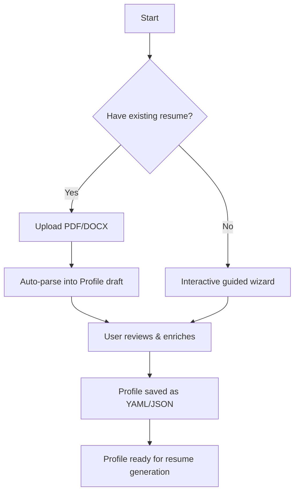

### Step-by-step:
1. **Import** — Upload existing resume. Parser auto-extracts what it can.
2. **Enrich** — System asks guided questions: *"You listed Python. How many years? What frameworks?"*
3. **Deep-dive** — User adds the full story: all bullet points, side projects, certifications.
4. **Q&A Bank** — System presents common screening questions. User pre-answers them.
5. **Review** — Final profile review. User saves.

---

## 4. Storage

```
data/
├── profiles/
│   └── candidate_profile.yaml      # The master profile
├── qa_bank.yaml                     # Extracted Q&A for quick access
└── resumes/
    ├── generated/
    │   ├── resume_job_12345.pdf     # Tailored for job #12345
    │   └── resume_job_67890.pdf
    └── templates/
        ├── classic.html             # ATS-friendly template
        └── modern.html
```

---

## 5. Profile → Resume Selection Logic

When generating a resume for a specific JD, the system:

1. **Extracts JD keywords** (skills, tools, responsibilities)
2. **Scores each profile bullet** against JD relevance (cosine similarity of embeddings)
3. **Selects top-N bullets per section** (e.g., top 4 bullets from most relevant job)
4. **Re-orders skills** — most relevant first
5. **Picks or generates summary** — selects best matching variant, or asks LLM to write a new one
6. **Assembles** into template → renders PDF


---

# 03 — ATS Analysis Engine

## 1. Purpose

Before applying, the system must answer: **"Will this resume pass the ATS filter for this specific job?"** The ATS Analysis Engine scores, diagnoses, and suggests fixes.

---

## 2. How ATS Systems Work (Background)

Modern Applicant Tracking Systems (Workday, Greenhouse, Lever, iCIMS, Taleo) do the following:

1. **Parse** the resume into structured fields (name, skills, experience)
2. **Extract keywords** from the resume text
3. **Compare** extracted keywords against the job requisition
4. **Rank** candidates by match percentage
5. **Filter** — resumes below a threshold (typically 60–75%) are never seen by a human

### Common ATS Pitfalls
| Issue | Why It Fails |
|---|---|
| Tables / columns | Parser reads cells in wrong order |
| Headers in images | Text inside images is invisible to ATS |
| Fancy fonts | Some fonts don't map to standard Unicode |
| Missing section headers | ATS can't find "Experience" or "Education" |
| Acronyms only | ATS searches for "Machine Learning", not just "ML" |
| File format | Some ATS choke on `.docx` formatting; plain text or clean PDF is safer |

---

## 3. Scoring Algorithm

### 3.1 Input
- `candidate_resume_text` — the generated resume text
- `job_description_text` — the full JD text

### 3.2 Scoring Components

| Component | Weight | Method |
|---|---|---|
| **Keyword Match** | 40% | TF-IDF or embedding similarity of skills/tools |
| **Section Completeness** | 15% | Check presence of: Summary, Experience, Education, Skills |
| **Keyword Density** | 15% | Ratio of JD keywords found in resume vs. total JD keywords |
| **Experience Relevance** | 15% | Semantic similarity of bullet points to JD responsibilities |
| **Formatting Score** | 15% | No tables, standard headers, parseable structure |

### 3.3 Keyword Matching Detail

```python
# Pseudocode
def calculate_keyword_score(resume_text, jd_text):
    jd_keywords = extract_keywords(jd_text)         # spaCy NER + noun chunks
    resume_keywords = extract_keywords(resume_text)

    # Exact matches
    exact_matches = jd_keywords & resume_keywords

    # Fuzzy matches (e.g., "Kubernetes" ≈ "K8s")
    fuzzy_matches = fuzzy_match(jd_keywords - exact_matches, resume_keywords)

    # Semantic matches (embeddings)
    semantic_matches = embedding_similarity(
        jd_keywords - exact_matches - fuzzy_matches,
        resume_keywords,
        threshold=0.85
    )

    total_matched = len(exact_matches) + len(fuzzy_matches) + len(semantic_matches)
    return (total_matched / len(jd_keywords)) * 100
```

### 3.4 Output

```json
{
  "overall_score": 78,
  "breakdown": {
    "keyword_match": 82,
    "section_completeness": 100,
    "keyword_density": 71,
    "experience_relevance": 65,
    "formatting": 95
  },
  "missing_keywords": [
    {"keyword": "Terraform", "category": "DevOps Tool", "importance": "high"},
    {"keyword": "CI/CD", "category": "Practice", "importance": "medium"}
  ],
  "suggestions": [
    "Add 'Terraform' to skills section — mentioned 3 times in JD",
    "Include 'CI/CD' in at least one experience bullet",
    "Consider expanding acronym 'ML' to 'Machine Learning'"
  ],
  "formatting_issues": []
}
```

---

## 4. Improvement Suggestions Engine

When the score is below threshold (configurable, default 70%), the system:

1. **Identifies gaps** — keywords in JD but not in resume
2. **Searches Candidate Profile** — does the candidate actually have this skill?
   - **If yes** → Suggest adding it. System can auto-include it in next generation.
   - **If no** → Flag as "Skill Gap" (informational only — won't fabricate).
3. **Re-orders content** — move matching bullets higher
4. **Rewrites summary** — LLM generates a new summary incorporating missing keywords

> [!IMPORTANT]
> The system **never fabricates** experience or skills. It can only use what exists in the Candidate Profile. If the profile doesn't mention Terraform, it won't add Terraform.

---

## 5. Integration Points

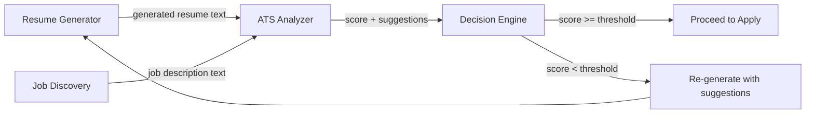

The analyze → generate → re-analyze loop runs at most **2 iterations** to avoid infinite loops. If the score is still low after 2 passes, the job is flagged for manual review.


---

# 04 — Job Discovery Engine

## 1. Purpose

Continuously find relevant jobs across multiple portals, deduplicate, score, and queue them for resume generation and automated application.

---

## 2. Supported Portals

| Portal | Method | Apply Support | Notes |
|---|---|---|---|
| **LinkedIn** | Playwright scraping | Easy Apply | Requires login. Most jobs. |
| **Indeed** | Playwright scraping | Indeed Apply | Large volume, many duplicates |
| **Glassdoor** | Playwright scraping | Easy Apply / Redirect | Often redirects to company ATS |
| **Company Career Pages** | Per-company drivers (Workday, Greenhouse, Lever) | Native forms | Phase 2+ |

---

## 3. Search Configuration

```yaml
# config/search_config.yaml
search_profiles:
  - name: "Backend Engineer Search"
    keywords: ["backend engineer", "python developer", "software engineer"]
    location: "San Francisco, CA"
    radius_miles: 50
    remote_only: false
    date_posted: "past_week"       # past_24h | past_week | past_month
    salary_min: 150000
    experience_level: "senior"     # entry | mid | senior | lead
    job_type: "full_time"          # full_time | part_time | contract
    portals: ["linkedin", "indeed"]

  - name: "Remote ML Engineer"
    keywords: ["machine learning engineer", "ML engineer", "AI engineer"]
    location: "United States"
    remote_only: true
    date_posted: "past_24h"
    portals: ["linkedin", "indeed", "glassdoor"]

schedule:
  interval_hours: 4
  max_jobs_per_run: 100
  quiet_hours: "23:00-07:00"       # Don't scrape during these hours
```

---

## 4. Scraping Architecture

### 4.1 Portal Driver Interface

Every portal implements this interface:

```python
class PortalDriver(ABC):
    """Base class for all job portal scrapers."""

    @abstractmethod
    async def login(self, credentials: dict) -> bool:
        """Authenticate to the portal."""

    @abstractmethod
    async def search_jobs(self, params: SearchParams) -> list[RawJob]:
        """Execute search and return raw job list."""

    @abstractmethod
    async def get_job_details(self, job_url: str) -> JobDetails:
        """Fetch full job description from a listing."""

    @abstractmethod
    async def apply(self, job: Job, resume_path: str, qa_answers: dict) -> ApplicationResult:
        """Submit an application for a specific job."""
```

### 4.2 Scraping Flow

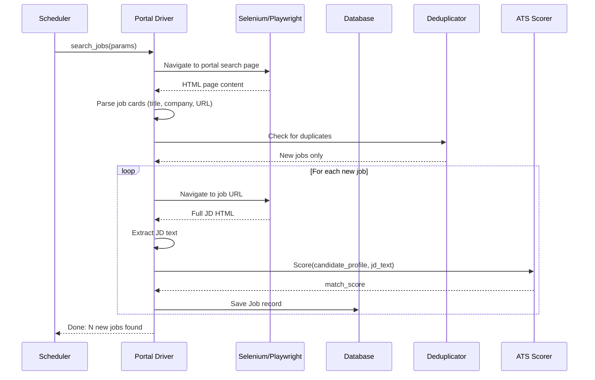

---

## 5. Deduplication Strategy

Jobs appear on multiple portals. We deduplicate by:

1. **Exact URL match** — same URL = same job
2. **Fuzzy title + company match** — "Senior Backend Eng at Acme" on LinkedIn ≈ "Sr. Backend Engineer — Acme Corp" on Indeed
3. **JD text similarity** — if two JDs have >90% text overlap, they're duplicates

```python
def is_duplicate(new_job: Job, existing_jobs: list[Job]) -> bool:
    for existing in existing_jobs:
        # Check 1: URL
        if normalize_url(new_job.url) == normalize_url(existing.url):
            return True
        # Check 2: Title + Company fuzzy
        title_sim = fuzz.ratio(new_job.title.lower(), existing.title.lower())
        company_sim = fuzz.ratio(new_job.company.lower(), existing.company.lower())
        if title_sim > 85 and company_sim > 80:
            return True
        # Check 3: JD text
        if existing.description_text and new_job.description_text:
            jd_sim = text_similarity(new_job.description_text, existing.description_text)
            if jd_sim > 0.90:
                return True
    return False
```

---

## 6. Smart Filtering & Blacklisting

Before scoring, apply filters to discard irrelevant results:

```python
BLACKLIST_RULES = [
    # Company blacklist
    lambda job: job.company.lower() in config.companies_blacklist,
    # Keyword blacklist in title
    lambda job: any(kw in job.title.lower() for kw in config.keywords_blacklist),
    # Staffing agency detection
    lambda job: any(word in job.company.lower() for word in ["staffing", "consulting group", "tek"]),
    # Already applied
    lambda job: job.url in applied_urls,
    # Promoted/sponsored postings (often irrelevant)
    lambda job: job.is_promoted and config.skip_promoted,
]
```

---

## 7. Job Scoring Against Profile

Each discovered job is scored against the full Candidate Profile:

| Factor | Weight | How |
|---|---|---|
| **Skills overlap** | 40% | Intersection of JD required skills and profile skills |
| **Experience years match** | 20% | Profile total years vs. JD requirement |
| **Title relevance** | 20% | Embedding similarity of target_roles to job title |
| **Location/Remote fit** | 10% | Does the job match preferences? |
| **Salary fit** | 10% | Is the salary above min_salary? |

Jobs scoring **≥ 70%** are auto-queued for resume generation and application.
Jobs scoring **50–69%** are flagged for user review.
Jobs scoring **< 50%** are auto-ignored.

---

## 8. Data Model

```python
class Job:
    id: int                     # Auto-increment
    external_id: str            # Portal-specific ID
    title: str
    company: str
    location: str
    salary_range: str | None
    description_text: str       # Full JD
    url: str
    source: str                 # "linkedin" | "indeed" | "glassdoor"
    match_score: float          # 0-100
    status: str                 # NEW | QUEUED | APPLIED | SKIPPED | FAILED
    discovered_at: datetime
    applied_at: datetime | None
    resume_path: str | None     # Path to tailored resume used
    notes: str | None           # Failure reason, etc.
```


---

# 05 — Resume Generation Engine

## 1. Purpose

For **every** job the system decides to apply to, it generates a **unique, ATS-optimized PDF resume** tailored to that specific job description — using the rich Candidate Profile as source material.

---

## 2. End-to-End Generation Pipeline

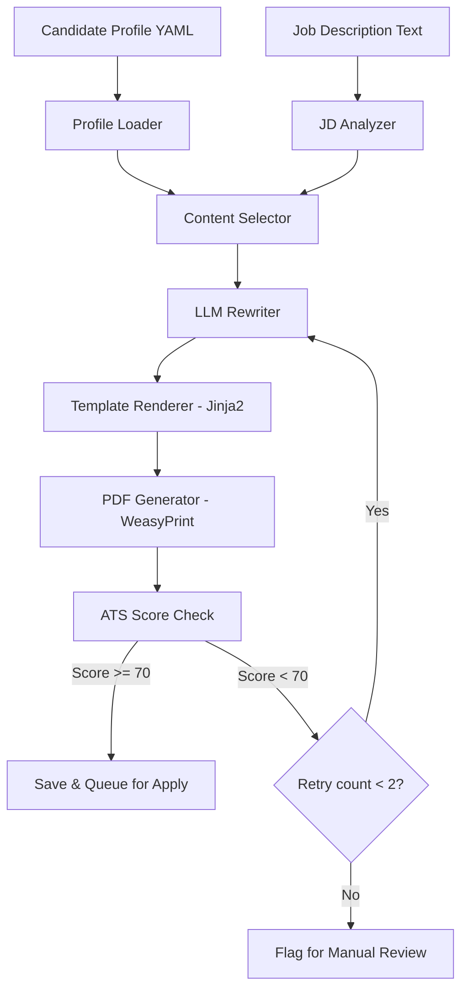

---

## 3. Stage 1: JD Analysis

Extract structured intelligence from the job description:

```python
class JDAnalysis:
    required_skills: list[str]       # "Python", "AWS", "Kubernetes"
    preferred_skills: list[str]      # "Go", "Terraform"
    years_experience: int | None     # 5
    education_requirement: str       # "BS in CS or equivalent"
    responsibilities: list[str]      # Key responsibility sentences
    company_values: list[str]        # "fast-paced", "collaborative"
    industry_keywords: list[str]     # "fintech", "payments"
```

**Method**: LLM extraction (prompt the LLM with the full JD, ask for structured JSON output).

---

## 4. Stage 2: Content Selection

Given the JD analysis, select the most relevant content from the Candidate Profile.

### 4.1 Skills Selection
```
1. Take all JD required_skills
2. Find matches in profile.skills (exact, fuzzy, alias)
3. Order: exact matches first, then fuzzy, then related
4. Cap at template limit (e.g., 15 skills for a 1-page resume)
5. If space allows, add preferred_skills matches
```

### 4.2 Experience Bullet Selection
```
For each role in profile.experience:
    1. Compute relevance score for each bullet against JD
       - Embedding similarity (bullet text ↔ JD responsibilities)
       - Tag overlap (bullet.tags ∩ JD required_skills)
    2. Rank bullets by relevance score
    3. Select top N bullets (e.g., 4 for most recent role, 3 for older roles)
    4. Ensure diversity — don't pick 4 bullets all about the same topic
```

### 4.3 Project Selection
```
1. Score each project against JD (tech_stack overlap, tag overlap)
2. Select top 2 projects
3. If candidate has few matching projects, skip projects section entirely
```

### 4.4 Summary Generation
```
1. Check if any profile.summaries[].target_role matches the JD title
2. If match found → use as base, ask LLM to refine with specific JD keywords
3. If no match → ask LLM to generate a new summary using:
   - Candidate's top skills matching JD
   - Years of experience
   - Most relevant achievements
   - JD company values / keywords
```

---

## 5. Stage 3: LLM Rewriting

The LLM is used for two tasks:

### 5.1 Summary Rewriting
```
Prompt:
  You are an expert resume writer. Write a 3-sentence professional summary for a
  candidate applying to this role:

  Job Title: {jd.title}
  Company: {jd.company}
  Key Requirements: {jd.required_skills}

  Candidate Info:
  - {experience_years} years of experience
  - Top skills: {selected_skills}
  - Recent achievement: {top_bullet}

  Rules:
  - Include these keywords naturally: {missing_keywords}
  - Do NOT fabricate experience
  - Keep it under 60 words
  - Use active voice
```

### 5.2 Bullet Point Enhancement (Optional)
If a bullet is relevant but doesn't include a JD keyword, the LLM can rephrase:

```
Original: "Built a caching layer that improved response times"
JD keyword needed: "Redis"
Profile confirms: candidate knows Redis

Enhanced: "Built a Redis-based caching layer that improved API response times by 60%"
```

> [!CAUTION]
> LLM rewriting is **constrained** — it can only rephrase using facts from the Candidate Profile. It cannot add skills or experiences not present in the profile.

---

## 6. Stage 4: Template Rendering

### 6.1 Template System
- Templates are HTML + CSS files processed by **Jinja2**
- ATS-friendly: no tables for layout, no columns, no images, standard fonts
- Single-column layout with clear section headers

### 6.2 Available Templates

| Template | Use Case | Layout |
|---|---|---|
| `classic.html` | Default, works everywhere | Single column, serif font |
| `modern.html` | Tech roles | Single column, sans-serif, subtle color |
| `compact.html` | 1-page strict | Tighter spacing, smaller font |

### 6.3 Template Structure
```html
<!DOCTYPE html>
<html>
<head><style>{{ css }}</style></head>
<body>
  <header>
    <h1>{{ name }}</h1>
    <p>{{ email }} | {{ phone }} | {{ location }}</p>
    <p>{{ linkedin }} | {{ github }}</p>
  </header>

  <section id="summary">
    <h2>Professional Summary</h2>
    <p>{{ summary }}</p>
  </section>

  <section id="skills">
    <h2>Technical Skills</h2>
    <p>{{ skills | join(", ") }}</p>
  </section>

  <section id="experience">
    <h2>Professional Experience</h2>
    
    <div class="role">
      <h3>{{ role.title }} — {{ role.company }}</h3>
      <span>{{ role.dates }} | {{ role.location }}</span>
      <ul>
        
        <li>{{ bullet }}</li>
        
      </ul>
    </div>
    
  </section>

  <!-- Education, Certifications, Projects as needed -->
</body>
</html>
```

---

## 7. Stage 5: PDF Generation

```python
from weasyprint import HTML

def generate_pdf(html_content: str, output_path: str):
    HTML(string=html_content).write_pdf(output_path)
```

**Output**: `data/resumes/generated/resume_job_{job_id}.pdf`

---

## 8. Stage 6: Quality Gate (ATS Re-Score)

After generation, the resume is scored against the JD using the ATS Analysis Engine:

- **Score ≥ 70%** → Proceed to application
- **Score < 70%** → Retry generation with adjusted content (max 2 retries)
- **After 2 retries, still < 70%** → Flag for manual review

This creates a **closed feedback loop** ensuring every submitted resume is optimized.

---

## 9. Caching & Efficiency

To avoid redundant LLM calls:

- **Similar JDs** — if a new JD is >90% similar to a previously processed JD, reuse the same resume
- **Summary cache** — cache generated summaries by `(target_role, top_5_keywords)` tuple
- **Batch processing** — generate resumes for multiple jobs in parallel (thread pool)


---

# 06 — Application Automation Engine

## 1. Purpose

This is the most complex engine — it must **navigate different job portals**, each with unique UIs and form flows and **submit applications without human involvement**. This document defines the complete strategy.

---

## 2. The Core Challenge

Every portal has a different application flow:

| Portal | Flow Type | Steps |
|---|---|---|
| **LinkedIn Easy Apply** | Multi-step modal | Click "Easy Apply" → Contact Info → Resume Upload → Screening Qs → Review → Submit |
| **Indeed Apply** | Inline form | Click "Apply" → Pre-filled from profile → Resume → Questions → Submit |
| **Glassdoor** | Redirect | Often redirects to company ATS (Workday, Greenhouse, etc.) |
| **Workday** | Full external form | Create account (or login) → Multi-page form → Upload → Questions → Submit |
| **Greenhouse** | External form | Single-page form → Name, email, resume, cover letter, custom questions |
| **Lever** | External form | Similar to Greenhouse, single-page with resume parsing |
| **Company websites** | Anything | Wildcard — completely custom forms |

---

## 3. Portal Driver Plugin System

### 3.1 Architecture

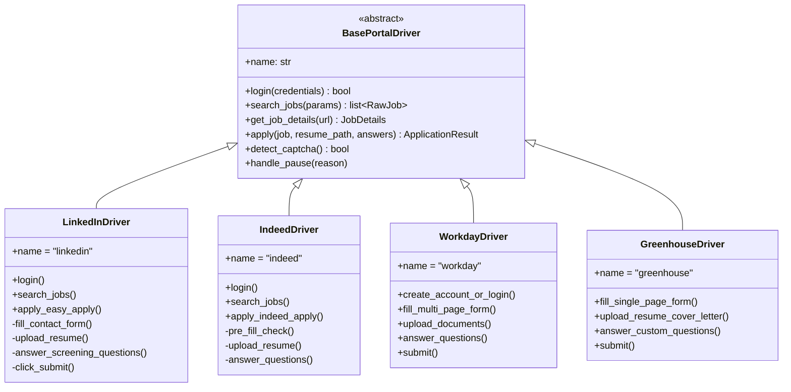

### 3.2 Adding a New Portal

To support a new portal, create a new driver class:

```python
# drivers/naukri_driver.py
class NaukriDriver(BasePortalDriver):
    name = "naukri"

    async def login(self, credentials):
        # Naukri-specific login flow
        ...

    async def apply(self, job, resume_path, answers):
        # Naukri-specific form filling
        ...
```

Register it in the driver registry:

```python
PORTAL_DRIVERS = {
    "linkedin": LinkedInDriver,
    "indeed": IndeedDriver,
    "workday": WorkdayDriver,
    "greenhouse": GreenhouseDriver,
    "naukri": NaukriDriver,  # Just add the line
}
```

---

## 4. Detailed Application Flows

### 4.1 LinkedIn Easy Apply

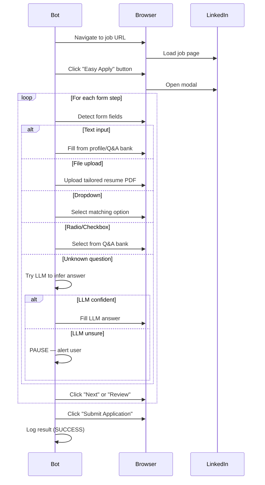

**Key selectors** (stored in `config/selectors/linkedin.yaml`):
```yaml
linkedin:
  easy_apply_button: "button.jobs-apply-button"
  modal_container: "div.jobs-easy-apply-modal"
  next_button: "button[aria-label='Continue to next step']"
  review_button: "button[aria-label='Review your application']"
  submit_button: "button[aria-label='Submit application']"
  resume_upload: "input[type='file']"
  text_input: "input[type='text'], textarea"
  dropdown: "select"
  radio: "input[type='radio']"
  error_message: "div.artdeco-inline-feedback"
```

### 4.2 Indeed Apply

```
1. Navigate to job URL
2. Click "Apply now" button
3. Indeed shows pre-filled form (from Indeed profile)
4. Check each field — override with our data if needed
5. Upload resume
6. Answer screening questions (if any)
7. Click "Submit your application"
8. Log result
```

### 4.3 Workday (Enterprise ATS)

Workday is more complex:
```
1. Redirect from job board → company Workday URL
2. Check if we have an account → Login or Create Account
   - Account creation: email, password, name
   - Store credentials in encrypted vault
3. Navigate to job → Click "Apply"
4. Multi-page form:
   - Page 1: Personal Info (pre-fill from profile)
   - Page 2: Experience (may ask to re-enter manually)
   - Page 3: Education
   - Page 4: Resume upload + Cover letter (optional)
   - Page 5: Diversity questions (skip or answer default)
   - Page 6: Review & Submit
5. Log result
```

### 4.4 Greenhouse / Lever

These are simpler — typically single-page forms:
```
1. Navigate to application URL
2. Fill: First Name, Last Name, Email, Phone
3. Upload Resume
4. Upload Cover Letter (if required — generate one)
5. Answer custom questions (text fields, dropdowns)
6. Click "Submit Application"
7. Log result
```

---

## 5. Intelligent Question Answering

### 5.1 Three-Tier Answer Strategy

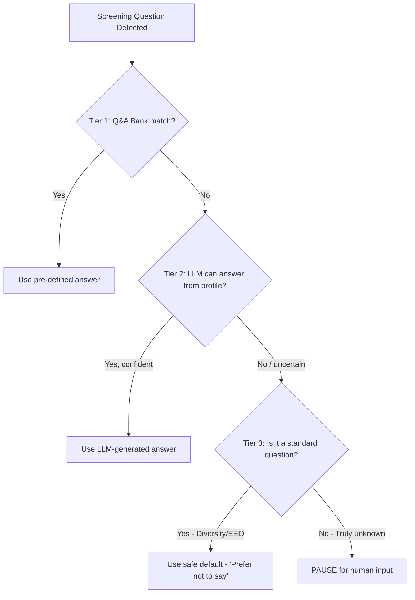

### 5.2 Q&A Matching

```python
def find_answer(question_text: str, qa_bank: list[QAEntry]) -> str | None:
    """Match a question against the Q&A bank using fuzzy matching."""
    for entry in qa_bank:
        # Regex pattern match
        if re.search(entry.question_pattern, question_text, re.IGNORECASE):
            return entry.answer

    # Embedding similarity fallback
    question_embedding = embed(question_text)
    for entry in qa_bank:
        similarity = cosine_sim(question_embedding, embed(entry.question_pattern))
        if similarity > 0.85:
            return entry.answer

    return None  # No match — escalate
```

### 5.3 LLM Fallback

```python
def llm_answer_question(question: str, profile: CandidateProfile) -> tuple[str, float]:
    """Ask LLM to answer based on candidate profile. Returns (answer, confidence)."""
    prompt = f"""
    A job application asks: "{question}"

    Candidate profile summary:
    - Experience: {profile.total_years} years
    - Skills: {profile.top_skills}
    - Education: {profile.education_summary}

    Answer this question truthfully based on the profile.
    If you cannot determine the answer from the profile, say "UNKNOWN".

    Respond with JSON: {{"answer": "...", "confidence": 0.0-1.0}}
    """
    result = llm.generate(prompt)
    if result.confidence >= 0.8:
        return result.answer, result.confidence
    return None, result.confidence
```

---

## 6. Anti-Detection & Safety

### 6.1 Human-Like Behavior

```python
class HumanSimulator:
    """Adds realistic delays and behaviors to avoid bot detection."""

    def random_delay(self, min_sec=2, max_sec=6):
        time.sleep(random.uniform(min_sec, max_sec))

    def type_slowly(self, element, text):
        for char in text:
            element.send_keys(char)
            time.sleep(random.uniform(0.05, 0.15))

    def random_scroll(self, driver):
        scroll_amount = random.randint(100, 500)
        driver.execute_script(f"window.scrollBy(0, {scroll_amount})")
        self.random_delay(0.5, 1.5)

    def random_mouse_move(self, driver, element):
        # Move to element with random offset
        action = ActionChains(driver)
        offset_x = random.randint(-5, 5)
        offset_y = random.randint(-5, 5)
        action.move_to_element_with_offset(element, offset_x, offset_y).perform()
```

### 6.2 Rate Limiting

```yaml
# config/safety.yaml
rate_limits:
  daily_applications:
    linkedin: 25        # Max 25 LinkedIn apps/day
    indeed: 30
    workday: 10
    total: 50           # Hard cap across all portals

  delays:
    between_applications_sec: [60, 180]   # 1-3 min between apps
    between_searches_sec: [30, 90]
    between_page_actions_sec: [2, 6]

  session:
    max_duration_hours: 3                  # Take a break after 3 hours
    break_duration_min: [30, 60]           # 30-60 min break
```

### 6.3 CAPTCHA Handling

```python
class CaptchaHandler:
    def detect(self, driver) -> bool:
        """Check if a CAPTCHA is present on the page."""
        captcha_indicators = [
            "//iframe[contains(@src, 'recaptcha')]",
            "//div[contains(@class, 'captcha')]",
            "//div[@id='challenge-stage']",
        ]
        for xpath in captcha_indicators:
            if driver.find_elements(By.XPATH, xpath):
                return True
        return False

    def handle(self, driver, job_id: int):
        """Pause automation and alert user."""
        logger.warning(f"CAPTCHA detected for job {job_id}")
        # Save screenshot
        driver.save_screenshot(f"captcha_{job_id}.png")
        # Send notification
        notify_user(
            method="telegram",  # or email, desktop notification
            message=f"CAPTCHA encountered for job {job_id}. Please solve manually.",
            screenshot=f"captcha_{job_id}.png"
        )
        # Wait for user to solve (poll every 10 sec)
        while self.detect(driver):
            time.sleep(10)
        logger.info("CAPTCHA resolved. Resuming.")
```

---

## 7. Application Result Logging

Every application attempt is logged:

```python
class ApplicationResult:
    job_id: int
    portal: str
    status: str           # SUCCESS | FAILED | SKIPPED | MANUAL_NEEDED
    error_message: str | None
    screenshot_path: str | None  # Screenshot on failure
    resume_used: str             # Path to resume PDF used
    questions_answered: list[dict]  # {question, answer, source}
    duration_seconds: float
    timestamp: datetime
```

---

## 8. Orchestration Flow (Putting It All Together)

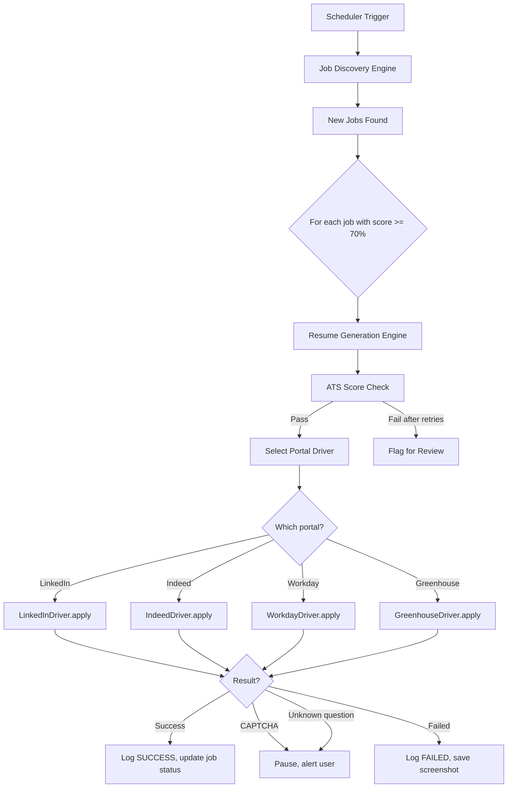


---

# 07 — High-Level Architecture

## 1. System Overview

The ATS Optimizer is a **locally-running Python application** with five main engines coordinated by a central orchestrator, a SQLite database, and a Streamlit dashboard.

---

## 2. Architecture Diagram

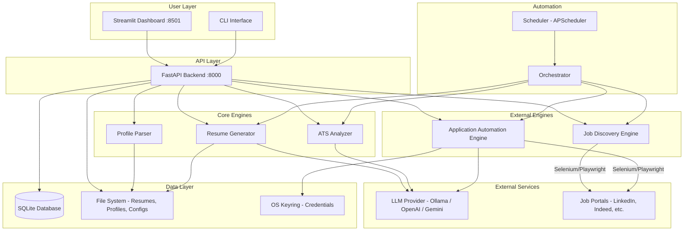

---

## 3. Component Responsibilities

| Component | Responsibility |
|---|---|
| **FastAPI Backend** | REST API. All user-facing operations go through here. |
| **Streamlit Dashboard** | Read-only views + trigger actions via API. No direct DB access. |
| **CLI** | Power-user alternative to the dashboard. Same API calls. |
| **Orchestrator** | The "brain" — coordinates the full pipeline: discover → score → generate → apply. |
| **Scheduler** | Cron-like triggers for periodic job discovery and application runs. |
| **Profile Parser** | Imports resume PDF/DOCX → extracts structured data → populates profile. |
| **ATS Analyzer** | Scores resume text vs. JD text. Suggests improvements. |
| **Resume Generator** | Selects profile content, uses LLM, renders HTML → PDF. |
| **Job Discovery Engine** | Manages portal drivers for scraping. Deduplicates. Scores. |
| **Application Automation Engine** | Manages portal drivers for applying. Fills forms. Handles errors. |
| **LLM Provider** | Abstracted interface — can switch between Ollama (local), OpenAI, or Gemini. |

---

## 4. Data Flow: Full Pipeline

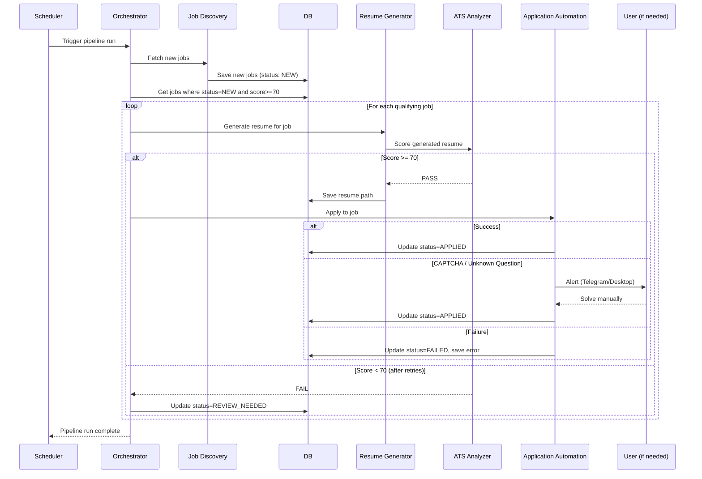

---

## 5. Technology Stack

| Layer | Technology | Why |
|---|---|---|
| **Backend API** | FastAPI | Async, fast, automatic OpenAPI docs |
| **Dashboard** | Streamlit | Rapid Python UI, no frontend build step |
| **Database** | SQLite + SQLAlchemy | Zero setup, local, sufficient for single-user |
| **Browser Automation** | Playwright (preferred) or Selenium | Playwright: faster, better async, auto-wait |
| **Resume Parsing** | pdfminer.six + spaCy | pdfminer for PDF text, spaCy for NER |
| **Resume Rendering** | Jinja2 + WeasyPrint | HTML→PDF with full CSS support |
| **LLM** | Ollama (local) / OpenAI API / Gemini API | Ollama for free/private, APIs for quality |
| **NLP** | spaCy + sentence-transformers | Keyword extraction + semantic similarity |
| **Scheduler** | APScheduler | Python-native, cron-like scheduling |
| **Config** | YAML files | Human-readable, git-friendly |
| **Credentials** | OS keyring (keyring lib) | Secure local credential storage |
| **Notifications** | Telegram Bot API / Desktop toast | Alert user on CAPTCHA / errors |

---

## 6. Directory Structure

```
ats-optimizer/
├── docs/                           # This documentation
│
├── src/
│   ├── __init__.py
│   ├── main.py                     # FastAPI app entry point
│   ├── cli.py                      # CLI commands (Click/Typer)
│   ├── config.py                   # Load YAML configs
│   ├── database.py                 # SQLAlchemy setup
│   ├── models.py                   # DB models (Job, Resume, Log)
│   ├── schemas.py                  # Pydantic request/response models
│   │
│   ├── profile/
│   │   ├── __init__.py
│   │   ├── parser.py               # PDF/DOCX → structured data
│   │   ├── manager.py              # CRUD for candidate profile
│   │   └── enricher.py             # Guided questions to fill gaps
│   │
│   ├── analyzer/
│   │   ├── __init__.py
│   │   ├── scorer.py               # ATS scoring algorithm
│   │   ├── keywords.py             # Keyword extraction (spaCy)
│   │   └── suggestions.py          # Improvement suggestions
│   │
│   ├── discovery/
│   │   ├── __init__.py
│   │   ├── manager.py              # Orchestrates multi-portal search
│   │   ├── deduplicator.py         # Deduplication logic
│   │   └── scorer.py               # Job-profile match scoring
│   │
│   ├── generator/
│   │   ├── __init__.py
│   │   ├── content_selector.py     # Pick best bullets/skills
│   │   ├── llm_rewriter.py         # LLM summary/bullet rewriting
│   │   ├── renderer.py             # Jinja2 → HTML → PDF
│   │   └── templates/
│   │       ├── classic.html
│   │       ├── modern.html
│   │       └── styles.css
│   │
│   ├── automation/
│   │   ├── __init__.py
│   │   ├── orchestrator.py         # Full pipeline coordinator
│   │   ├── question_answerer.py    # Q&A bank + LLM fallback
│   │   ├── human_simulator.py      # Anti-detection delays
│   │   ├── captcha_handler.py      # Detect + pause + alert
│   │   └── drivers/
│   │       ├── __init__.py
│   │       ├── base.py             # BasePortalDriver ABC
│   │       ├── linkedin.py
│   │       ├── indeed.py
│   │       ├── workday.py
│   │       └── greenhouse.py
│   │
│   ├── llm/
│   │   ├── __init__.py
│   │   ├── provider.py             # Abstract LLM interface
│   │   ├── ollama_provider.py      # Local LLM via Ollama
│   │   ├── openai_provider.py      # OpenAI API
│   │   └── gemini_provider.py      # Google Gemini API
│   │
│   └── notifications/
│       ├── __init__.py
│       ├── telegram.py
│       └── desktop.py
│
├── config/
│   ├── search_config.yaml          # Job search parameters
│   ├── safety.yaml                 # Rate limits, delays
│   └── selectors/
│       ├── linkedin.yaml           # CSS/XPath selectors (not hardcoded)
│       ├── indeed.yaml
│       ├── workday.yaml
│       └── greenhouse.yaml
│
├── data/
│   ├── profiles/
│   │   └── candidate_profile.yaml
│   ├── qa_bank.yaml
│   └── resumes/
│       ├── generated/
│       └── templates/
│
├── frontend/
│   └── dashboard.py                # Streamlit app
│
├── tests/
│   ├── test_analyzer.py
│   ├── test_generator.py
│   ├── test_discovery.py
│   └── test_automation.py
│
├── requirements.txt
└── README.md
```


---

# 08 — Low-Level Design

## 1. Database Schema (SQLAlchemy Models)

### 1.1 Entity Relationship Diagram

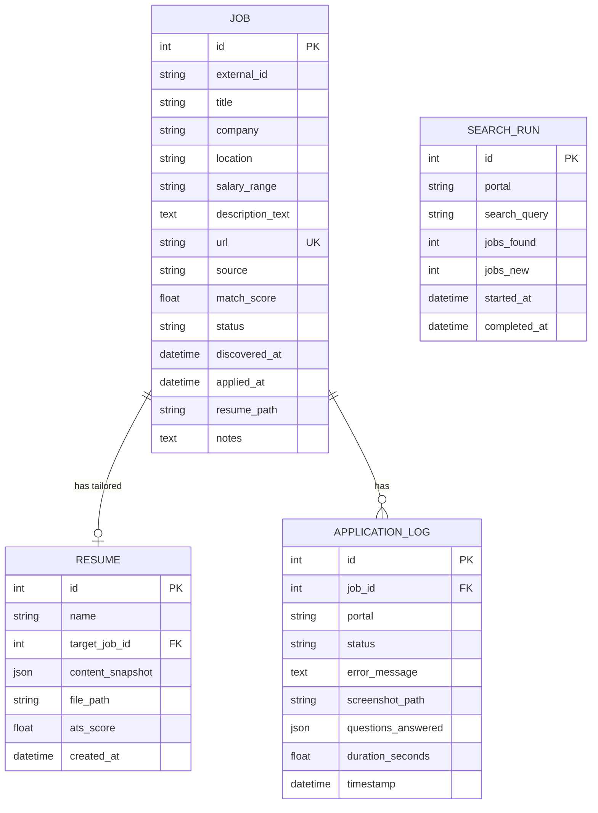

---

## 2. Pydantic Schemas (API Request/Response Models)

```python
# schemas.py

class JobResponse(BaseModel):
    id: int
    title: str
    company: str
    location: str | None
    url: str
    source: str
    match_score: float
    status: str
    discovered_at: datetime

class JobListResponse(BaseModel):
    total: int
    jobs: list[JobResponse]

class AnalyzeRequest(BaseModel):
    resume_text: str
    job_description: str

class AnalyzeResponse(BaseModel):
    overall_score: int
    breakdown: dict[str, int]
    missing_keywords: list[dict]
    suggestions: list[str]
    formatting_issues: list[str]

class ProfileUpdateRequest(BaseModel):
    section: str                   # "skills" | "experience" | "education" | ...
    data: dict                     # Section-specific data

class ApplyRequest(BaseModel):
    job_ids: list[int]             # Jobs to apply to
    dry_run: bool = False          # If true, simulate without submitting

class ApplyResponse(BaseModel):
    results: list[dict]            # [{job_id, status, message}]

class PipelineStatusResponse(BaseModel):
    is_running: bool
    current_phase: str | None      # "discovery" | "generation" | "applying"
    jobs_processed: int
    jobs_applied: int
    jobs_failed: int
    started_at: datetime | None
```

---

## 3. API Endpoints

| Method | Path | Description |
|---|---|---|
| **Profile** | | |
| `GET` | `/profile` | Get current candidate profile |
| `PUT` | `/profile` | Update a profile section |
| `POST` | `/profile/import` | Upload resume PDF/DOCX → parse into profile |
| **Analysis** | | |
| `POST` | `/analyze/score` | Score resume text vs. JD text |
| `POST` | `/analyze/suggestions` | Get improvement suggestions |
| **Jobs** | | |
| `GET` | `/jobs` | List jobs (filterable: status, score, portal) |
| `GET` | `/jobs/{id}` | Get job details |
| `PATCH` | `/jobs/{id}` | Update job status (e.g., mark as IGNORED) |
| `POST` | `/jobs/search` | Trigger manual job search |
| **Resumes** | | |
| `GET` | `/resumes` | List generated resumes |
| `GET` | `/resumes/{id}/download` | Download a generated PDF |
| `POST` | `/resumes/generate` | Generate resume for a specific job |
| **Applications** | | |
| `POST` | `/apply` | Apply to specific job(s) |
| `GET` | `/applications` | List application logs |
| **Pipeline** | | |
| `POST` | `/pipeline/start` | Start full automated pipeline |
| `POST` | `/pipeline/stop` | Stop running pipeline |
| `GET` | `/pipeline/status` | Get current pipeline status |
| **Config** | | |
| `GET` | `/config/search` | Get search configuration |
| `PUT` | `/config/search` | Update search configuration |
| `GET` | `/config/safety` | Get safety/rate-limit settings |
| `PUT` | `/config/safety` | Update safety settings |

---

## 4. Core Class Interfaces

### 4.1 Profile Module

```python
class ProfileManager:
    def load(self) -> CandidateProfile:
        """Load profile from YAML file."""

    def save(self, profile: CandidateProfile):
        """Save profile to YAML file."""

    def update_section(self, section: str, data: dict):
        """Update a specific section (skills, experience, etc.)."""

    def import_from_resume(self, file_path: str) -> CandidateProfile:
        """Parse PDF/DOCX and create initial profile draft."""

class ResumeImporter:
    def parse_pdf(self, path: str) -> str:
        """Extract raw text from PDF using pdfminer."""

    def parse_docx(self, path: str) -> str:
        """Extract text from DOCX using python-docx."""

    def extract_entities(self, text: str) -> dict:
        """Use spaCy NER to extract structured data."""
```

### 4.2 Analyzer Module

```python
class ATSScorer:
    def score(self, resume_text: str, jd_text: str) -> ScoreResult:
        """Calculate ATS compatibility score (0-100)."""

class KeywordExtractor:
    def extract(self, text: str) -> list[Keyword]:
        """Extract keywords using spaCy noun chunks + NER."""

    def extract_with_importance(self, jd_text: str) -> list[ScoredKeyword]:
        """Extract keywords with importance weight based on frequency and position."""

class SuggestionEngine:
    def suggest(self, score_result: ScoreResult, profile: CandidateProfile) -> list[Suggestion]:
        """Generate actionable suggestions to improve ATS score."""
```

### 4.3 Discovery Module

```python
class DiscoveryManager:
    def __init__(self, drivers: dict[str, BasePortalDriver]):
        self.drivers = drivers

    async def run_search(self, config: SearchConfig) -> list[Job]:
        """Execute search across all configured portals."""

    async def score_jobs(self, jobs: list[Job], profile: CandidateProfile):
        """Score each job against the candidate profile."""

class Deduplicator:
    def deduplicate(self, new_jobs: list[Job], existing_jobs: list[Job]) -> list[Job]:
        """Return only truly new jobs."""
```

### 4.4 Generator Module

```python
class ContentSelector:
    def select(self, profile: CandidateProfile, jd_analysis: JDAnalysis) -> ResumeContent:
        """Pick the most relevant skills, bullets, projects for this JD."""

class LLMRewriter:
    def rewrite_summary(self, profile: CandidateProfile, jd: JDAnalysis) -> str:
        """Generate a tailored professional summary."""

    def enhance_bullet(self, bullet: str, keywords: list[str], profile: CandidateProfile) -> str:
        """Optionally rephrase a bullet to include missing keywords."""

class ResumeRenderer:
    def render_html(self, content: ResumeContent, template: str) -> str:
        """Render Jinja2 template with selected content."""

    def render_pdf(self, html: str, output_path: str):
        """Convert HTML to PDF using WeasyPrint."""
```

### 4.5 Automation Module

```python
class Orchestrator:
    """Coordinates the full pipeline: discover → score → generate → apply."""

    def __init__(self, discovery, generator, analyzer, drivers, config):
        ...

    async def run_pipeline(self):
        """Execute one full pipeline run."""
        jobs = await self.discovery.run_search(self.config.search)
        for job in jobs:
            if job.match_score >= self.config.auto_apply_threshold:
                resume = await self.generator.generate(job)
                score = self.analyzer.score(resume.text, job.description_text)
                if score.overall >= self.config.min_ats_score:
                    driver = self.drivers[job.source]
                    result = await driver.apply(job, resume.file_path, self.qa_bank)
                    self.log_result(result)

class QuestionAnswerer:
    def answer(self, question: str) -> tuple[str | None, str]:
        """Returns (answer, source) where source is 'qa_bank' | 'llm' | 'default'."""

class HumanSimulator:
    def delay(self, min_sec: float, max_sec: float): ...
    def type_slowly(self, element, text): ...
    def random_scroll(self, driver): ...
```

---

## 5. Configuration Files

### 5.1 Main Config (`config/app.yaml`)

```yaml
app:
  name: "ATS Optimizer"
  version: "1.0.0"

database:
  url: "sqlite:///data/ats_optimizer.db"

llm:
  provider: "ollama"           # ollama | openai | gemini
  model: "llama3"              # Model name
  api_key: null                # Only for cloud providers
  base_url: "http://localhost:11434"

browser:
  engine: "playwright"         # playwright | selenium
  headless: true               # false for debugging
  user_data_dir: "data/browser_profiles"

notifications:
  enabled: true
  method: "desktop"            # desktop | telegram | email
  telegram_bot_token: null
  telegram_chat_id: null
```

### 5.2 Selectors Config (`config/selectors/linkedin.yaml`)

```yaml
# Externalized selectors — easy to update when LinkedIn changes its DOM
login:
  username_input: "#username"
  password_input: "#password"
  login_button: "button[type='submit']"

search:
  search_box: "input[id='jobs-search-box-keyword-id-ember']"
  location_box: "input[id='jobs-search-box-location-id-ember']"
  easy_apply_filter: "button[aria-label='Easy Apply filter']"
  job_cards: "div.job-card-container"
  job_title: "a.job-card-list__title"
  job_company: "span.job-card-container__primary-description"

easy_apply:
  apply_button: "button.jobs-apply-button"
  modal: "div.jobs-easy-apply-modal"
  next_button: "button[aria-label='Continue to next step']"
  review_button: "button[aria-label='Review your application']"
  submit_button: "button[aria-label='Submit application']"
  close_button: "button[aria-label='Dismiss']"
  file_input: "input[type='file']"
  text_inputs: "input[type='text']:not([readonly]), textarea"
  select_inputs: "select"
  radio_inputs: "fieldset input[type='radio']"
  error_banner: "div.artdeco-inline-feedback--error"
```

---

## 6. Error Handling Strategy

| Error Type | Handling |
|---|---|
| **Network timeout** | Retry 3 times with exponential backoff (2s, 4s, 8s) |
| **Element not found** | Screenshot + log. Skip this job, continue pipeline. |
| **Login failed** | Alert user. Pause pipeline. |
| **CAPTCHA** | Screenshot + alert. Wait for manual solve. |
| **Rate limited / blocked** | Pause pipeline for configured break duration. |
| **LLM error** | Retry once. If fails, use template summary (no LLM). |
| **PDF generation error** | Log error. Skip this job. |
| **Database error** | Critical — stop pipeline, alert user. |


---

# 09 — Implementation Roadmap

## 1. Phased Approach

The project is divided into **5 phases**, each producing a usable increment. Each phase builds on the previous one.

---

## 2. Phase Overview

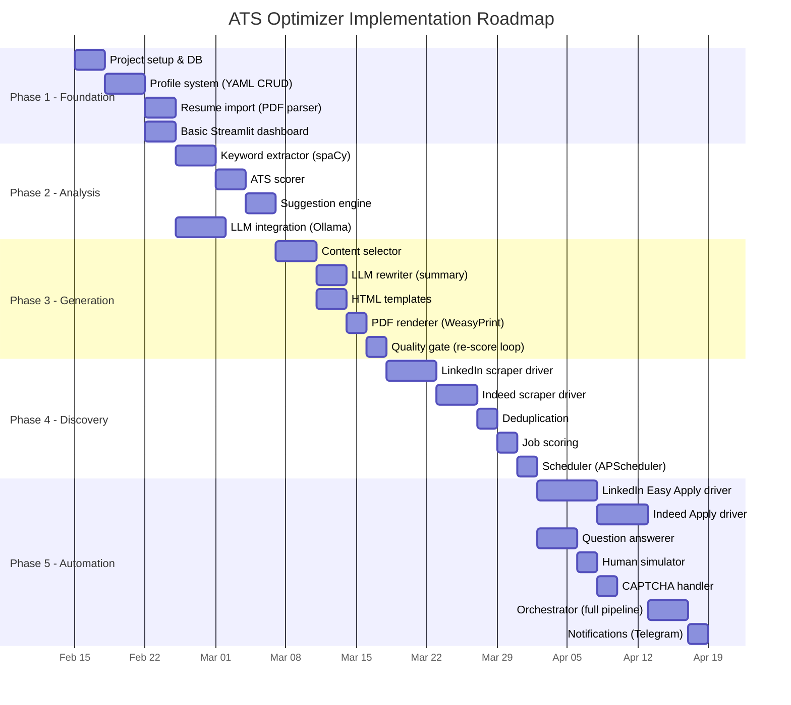

---

## 3. Phase Details

### Phase 1: Foundation (Week 1–2)

**Goal**: Set up the project, implement the Candidate Profile system, and create a basic dashboard.

| Task | Files | Dependencies |
|---|---|---|
| Project skeleton (FastAPI, SQLAlchemy, configs) | `src/main.py`, `src/database.py`, `src/models.py`, `requirements.txt` | None |
| Candidate Profile YAML schema & manager | `src/profile/manager.py` | None |
| Resume import (PDF → structured data) | `src/profile/parser.py` | pdfminer.six, spaCy |
| Q&A bank management | `data/qa_bank.yaml`, `src/profile/manager.py` | Profile manager |
| Basic Streamlit dashboard (profile view, job list) | `frontend/dashboard.py` | FastAPI running |

**Deliverable**: User can create a profile, import a resume, and view it in the dashboard.

---

### Phase 2: Analysis Engine (Week 2–3)

**Goal**: Score resumes against JDs and provide improvement suggestions.

| Task | Files | Dependencies |
|---|---|---|
| Keyword extractor (spaCy NER + noun chunks) | `src/analyzer/keywords.py` | spaCy model |
| ATS scoring algorithm (5-component weighted) | `src/analyzer/scorer.py` | Keyword extractor |
| Improvement suggestion engine | `src/analyzer/suggestions.py` | Scorer |
| LLM provider abstraction + Ollama integration | `src/llm/provider.py`, `src/llm/ollama_provider.py` | Ollama installed |
| API endpoints for analysis | `src/main.py` | Scorer |

**Deliverable**: User can paste a JD, get a score, and see suggestions.

---

### Phase 3: Resume Generation (Week 3–4)

**Goal**: Generate tailored PDFs for specific jobs.

| Task | Files | Dependencies |
|---|---|---|
| JD analysis (extract required skills, responsibilities) | `src/generator/content_selector.py` | LLM provider |
| Content selector (pick bullets, skills from profile) | `src/generator/content_selector.py` | Profile, keyword extractor |
| LLM summary rewriter | `src/generator/llm_rewriter.py` | LLM provider |
| HTML templates (classic, modern) | `src/generator/templates/*.html` | None |
| WeasyPrint PDF renderer | `src/generator/renderer.py` | WeasyPrint |
| Quality gate (score → retry loop) | `src/generator/renderer.py` | ATS scorer |

**Deliverable**: Given a JD, system generates a tailored, ATS-scored PDF.

---

### Phase 4: Job Discovery (Week 4–5)

**Goal**: Automatically find relevant jobs across portals.

| Task | Files | Dependencies |
|---|---|---|
| BasePortalDriver interface | `src/automation/drivers/base.py` | None |
| LinkedIn search driver | `src/automation/drivers/linkedin.py` | Playwright |
| Indeed search driver | `src/automation/drivers/indeed.py` | Playwright |
| Deduplication engine | `src/discovery/deduplicator.py` | fuzzywuzzy |
| Job-profile match scoring | `src/discovery/scorer.py` | Keyword extractor |
| APScheduler integration | `src/main.py` | APScheduler |
| Search config YAML | `config/search_config.yaml` | None |

**Deliverable**: System auto-discovers jobs on a schedule and scores them.

---

### Phase 5: Application Automation (Week 5–7)

**Goal**: Apply to jobs automatically.

| Task | Files | Dependencies |
|---|---|---|
| LinkedIn Easy Apply flow | `src/automation/drivers/linkedin.py` | LinkedIn search driver |
| Indeed Apply flow | `src/automation/drivers/indeed.py` | Indeed search driver |
| Question answerer (Q&A bank + LLM) | `src/automation/question_answerer.py` | Q&A bank, LLM |
| Human simulator (delays, typing) | `src/automation/human_simulator.py` | None |
| CAPTCHA detector & handler | `src/automation/captcha_handler.py` | Notifications |
| Orchestrator (full pipeline) | `src/automation/orchestrator.py` | All engines |
| Selector configs (externalized) | `config/selectors/*.yaml` | None |
| Safety config (rate limits) | `config/safety.yaml` | None |
| Telegram notifications | `src/notifications/telegram.py` | Telegram bot |
| Enhanced dashboard (pipeline control) | `frontend/dashboard.py` | All APIs |

**Deliverable**: Full autonomous pipeline — discover → score → generate → apply.

---

## 4. Tech Stack Summary

| Component | Choice | Alternative |
|---|---|---|
| Language | Python 3.11+ | — |
| Backend API | FastAPI | Flask |
| Dashboard | Streamlit | Gradio |
| Database | SQLite + SQLAlchemy | PostgreSQL (if scaling) |
| Browser | Playwright | Selenium |
| Resume PDF | WeasyPrint | ReportLab |
| NLP | spaCy + sentence-transformers | NLTK |
| LLM (local) | Ollama (Llama 3) | LM Studio |
| LLM (cloud) | OpenAI / Gemini | Anthropic |
| Scheduler | APScheduler | Celery (overkill) |
| Config | YAML (PyYAML) | TOML |
| Credentials | keyring | dotenv (less secure) |
| Notifications | Telegram Bot API | Email / Slack |

---

## 5. Testing Strategy

| Level | Tools | Coverage |
|---|---|---|
| **Unit tests** | pytest | Scoring algorithm, keyword extraction, content selection |
| **Integration tests** | pytest + testcontainers | API endpoints, DB operations |
| **E2E tests (scraping)** | Playwright, mock portal pages | Login flow, search, form fill |
| **Manual testing** | Headless=false mode | Watch the bot apply in real-time |

---

## 6. MVP Definition

The **Minimum Viable Product** includes:

- [x] Candidate Profile system (YAML input)
- [x] ATS scoring for any resume + JD pair
- [x] Resume generation (1 template, LLM summary)
- [x] LinkedIn job discovery + Easy Apply automation
- [x] Basic Streamlit dashboard
- [x] CAPTCHA pause-and-alert

**Not in MVP**: Indeed/Workday/Greenhouse drivers, multiple templates, cover letter generation, email notifications.

---

## 7. Risk Mitigation

| Risk | Probability | Impact | Mitigation |
|---|---|---|---|
| LinkedIn account suspended | Medium | High | Rate limit (25/day), human delays, session reuse |
| LinkedIn DOM changes | High | Medium | Externalized selectors in YAML, easy to update |
| LLM generates fabricated content | Low | High | Constrain to profile data only, no hallucination allowed |
| WeasyPrint rendering issues | Low | Medium | Test templates extensively, have fallback template |
| CAPTCHA on every attempt | Medium | High | Session cookies, reduce frequency, pause-and-alert |


---

