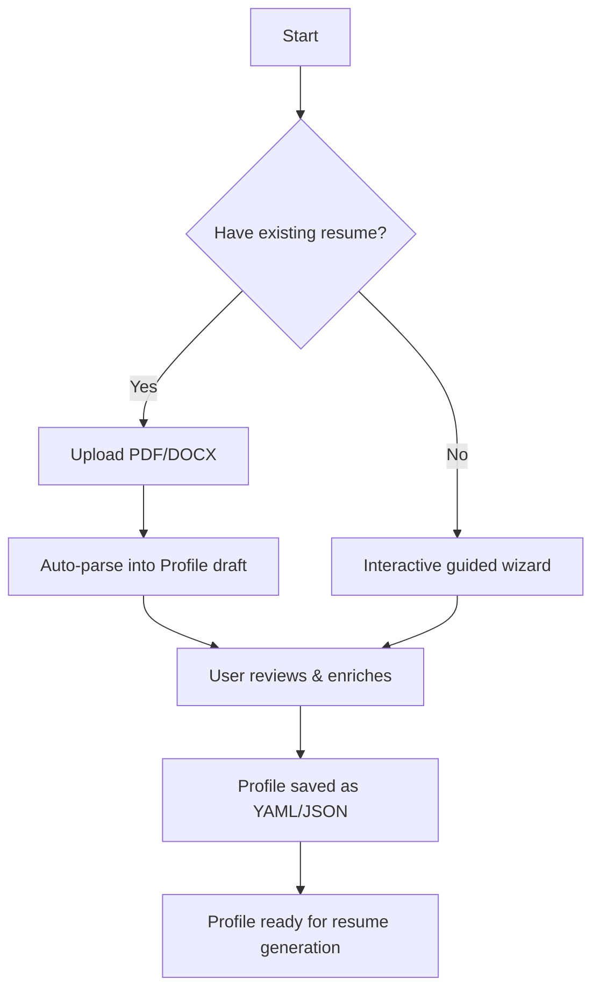

# 02 — Candidate Profile System

## 1. Philosophy

A traditional resume is a **1–2 page marketing brochure** — it's lossy. You throw away 80% of your experience to fit one page. Every time you tailor, you re-decide what to include.

The **Candidate Profile** is the opposite: a **5–10 page exhaustive source of truth** about your professional life. The system reads this profile and **generates** the perfect 1-page resume for each job, selecting the most relevant information.

> Think of it as: **Candidate Profile is the database. Resume is the query result.**

---

## 2. Profile Sections (Schema)

### 2.1 Personal Information
```yaml
personal:
  full_name: "Jane Doe"
  email: "jane@example.com"
  phone: "+1-555-0123"
  location: "San Francisco, CA"
  linkedin_url: "https://linkedin.com/in/janedoe"
  github_url: "https://github.com/janedoe"
  portfolio_url: "https://janedoe.dev"
  willing_to_relocate: true
  preferred_locations: ["San Francisco", "New York", "Remote"]
```

### 2.2 Professional Summary Variants
Multiple summaries written for different target roles. The LLM can also generate new ones.
```yaml
summaries:
  - target_role: "Backend Engineer"
    text: "7+ years building scalable distributed systems..."
  - target_role: "Full-Stack Developer"
    text: "Versatile engineer with deep expertise in both..."
  - target_role: "Data Engineer"
    text: "Systems engineer with strong data pipeline experience..."
```

### 2.3 Skills Inventory (Exhaustive)
Every skill, tool, technology — with proficiency level and years of use.
```yaml
skills:
  - name: "Python"
    category: "Programming Language"
    proficiency: "Expert"       # Beginner | Intermediate | Advanced | Expert
    years: 7
    keywords: ["python3", "cpython", "asyncio"]  # ATS keyword aliases
  - name: "Kubernetes"
    category: "DevOps"
    proficiency: "Advanced"
    years: 3
    keywords: ["k8s", "kubectl", "helm"]
  - name: "PostgreSQL"
    category: "Database"
    proficiency: "Expert"
    years: 6
    keywords: ["postgres", "psql", "pg"]
```

### 2.4 Work Experience (Complete History)
Every role, with **all** bullet points — not just the 3–4 you'd put on a resume.
```yaml
experience:
  - company: "Acme Corp"
    title: "Senior Backend Engineer"
    start_date: "2021-03"
    end_date: "2024-11"
    location: "San Francisco, CA"
    description: "Led backend team for the payments platform."
    bullets:
      - text: "Designed and implemented a distributed payment processing system handling 10M+ transactions/day"
        tags: ["distributed-systems", "payments", "architecture"]
        impact: "high"
      - text: "Reduced API latency by 40% by migrating from REST to gRPC"
        tags: ["performance", "grpc", "api-design"]
        impact: "high"
      - text: "Mentored 4 junior engineers through weekly 1:1s and code reviews"
        tags: ["leadership", "mentoring"]
        impact: "medium"
      - text: "Set up CI/CD pipelines using GitHub Actions and ArgoCD"
        tags: ["devops", "ci-cd", "github-actions"]
        impact: "medium"
      # ... 10-15 bullets per role (exhaustive)
```

### 2.5 Projects (Personal, Open Source, Side Projects)
```yaml
projects:
  - name: "Real-time Chat Engine"
    url: "https://github.com/janedoe/chat-engine"
    description: "WebSocket-based chat system supporting 50K concurrent users"
    tech_stack: ["Go", "Redis", "WebSocket", "Docker"]
    tags: ["real-time", "websocket", "scalability"]
    bullets:
      - "Implemented pub/sub message routing with Redis Streams"
      - "Achieved <50ms message delivery latency at 50K users"
```

### 2.6 Education
```yaml
education:
  - institution: "MIT"
    degree: "M.S. Computer Science"
    graduation_date: "2017-05"
    gpa: "3.8"
    relevant_courses: ["Distributed Systems", "Machine Learning", "Algorithms"]
    thesis: "Consensus Protocols for Edge Computing"
```

### 2.7 Certifications & Training
```yaml
certifications:
  - name: "AWS Solutions Architect - Professional"
    issuer: "Amazon Web Services"
    date: "2023-06"
    expiry: "2026-06"
    credential_id: "ABC123"
  - name: "Kubernetes Administrator (CKA)"
    issuer: "CNCF"
    date: "2022-09"
```

### 2.8 Publications & Talks
```yaml
publications:
  - title: "Scaling Payment Systems at Acme"
    venue: "QCon San Francisco 2023"
    type: "conference_talk"
    url: "https://youtube.com/watch?v=..."
```

### 2.9 Application Q&A Bank
Pre-answered questions for automated form filling.
```yaml
qa_bank:
  # Common screening questions
  - question_pattern: "years of experience"
    answer: "7"
  - question_pattern: "authorized to work"
    answer: "Yes"
  - question_pattern: "require sponsorship"
    answer: "No"
  - question_pattern: "willing to relocate"
    answer: "Yes"
  - question_pattern: "salary expectation"
    answer: "180000"
  - question_pattern: "notice period"
    answer: "2 weeks"
  - question_pattern: "highest education"
    answer: "Master's Degree"

  # Role-specific
  - question_pattern: "years.*python"
    answer: "7"
  - question_pattern: "years.*java"
    answer: "3"
  - question_pattern: "manage.*team"
    answer: "Yes, managed a team of 4 engineers"
```

### 2.10 Job Preferences
```yaml
preferences:
  target_roles: ["Senior Backend Engineer", "Staff Engineer", "Platform Engineer"]
  min_salary: 150000
  preferred_work_type: ["remote", "hybrid"]   # remote | hybrid | onsite
  industries_preferred: ["fintech", "healthtech", "saas"]
  industries_blacklist: ["defense", "gambling"]
  companies_blacklist: ["SketchyCorp", "BodyShopStaffing"]
  keywords_blacklist: ["unpaid", "intern", "entry-level"]
  max_commute_miles: 30
```

---

## 3. Data Capture Workflow



### Step-by-step:
1. **Import** — Upload existing resume. Parser auto-extracts what it can.
2. **Enrich** — System asks guided questions: *"You listed Python. How many years? What frameworks?"*
3. **Deep-dive** — User adds the full story: all bullet points, side projects, certifications.
4. **Q&A Bank** — System presents common screening questions. User pre-answers them.
5. **Review** — Final profile review. User saves.

---

## 4. Storage

```
data/
├── profiles/
│   └── candidate_profile.yaml      # The master profile
├── qa_bank.yaml                     # Extracted Q&A for quick access
└── resumes/
    ├── generated/
    │   ├── resume_job_12345.pdf     # Tailored for job #12345
    │   └── resume_job_67890.pdf
    └── templates/
        ├── classic.html             # ATS-friendly template
        └── modern.html
```

---

## 5. Profile → Resume Selection Logic

When generating a resume for a specific JD, the system:

1. **Extracts JD keywords** (skills, tools, responsibilities)
2. **Scores each profile bullet** against JD relevance (cosine similarity of embeddings)
3. **Selects top-N bullets per section** (e.g., top 4 bullets from most relevant job)
4. **Re-orders skills** — most relevant first
5. **Picks or generates summary** — selects best matching variant, or asks LLM to write a new one
6. **Assembles** into template → renders PDF
