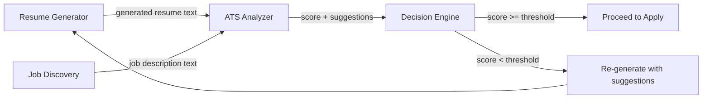

# 03 — ATS Analysis Engine

## 1. Purpose

Before applying, the system must answer: **"Will this resume pass the ATS filter for this specific job?"** The ATS Analysis Engine scores, diagnoses, and suggests fixes.

---

## 2. How ATS Systems Work (Background)

Modern Applicant Tracking Systems (Workday, Greenhouse, Lever, iCIMS, Taleo) do the following:

1. **Parse** the resume into structured fields (name, skills, experience)
2. **Extract keywords** from the resume text
3. **Compare** extracted keywords against the job requisition
4. **Rank** candidates by match percentage
5. **Filter** — resumes below a threshold (typically 60–75%) are never seen by a human

### Common ATS Pitfalls
| Issue | Why It Fails |
|---|---|
| Tables / columns | Parser reads cells in wrong order |
| Headers in images | Text inside images is invisible to ATS |
| Fancy fonts | Some fonts don't map to standard Unicode |
| Missing section headers | ATS can't find "Experience" or "Education" |
| Acronyms only | ATS searches for "Machine Learning", not just "ML" |
| File format | Some ATS choke on `.docx` formatting; plain text or clean PDF is safer |

---

## 3. Scoring Algorithm

### 3.1 Input
- `candidate_resume_text` — the generated resume text
- `job_description_text` — the full JD text

### 3.2 Scoring Components

| Component | Weight | Method |
|---|---|---|
| **Keyword Match** | 40% | TF-IDF or embedding similarity of skills/tools |
| **Section Completeness** | 15% | Check presence of: Summary, Experience, Education, Skills |
| **Keyword Density** | 15% | Ratio of JD keywords found in resume vs. total JD keywords |
| **Experience Relevance** | 15% | Semantic similarity of bullet points to JD responsibilities |
| **Formatting Score** | 15% | No tables, standard headers, parseable structure |

### 3.3 Keyword Matching Detail

```python
# Pseudocode
def calculate_keyword_score(resume_text, jd_text):
    jd_keywords = extract_keywords(jd_text)         # spaCy NER + noun chunks
    resume_keywords = extract_keywords(resume_text)

    # Exact matches
    exact_matches = jd_keywords & resume_keywords

    # Fuzzy matches (e.g., "Kubernetes" ≈ "K8s")
    fuzzy_matches = fuzzy_match(jd_keywords - exact_matches, resume_keywords)

    # Semantic matches (embeddings)
    semantic_matches = embedding_similarity(
        jd_keywords - exact_matches - fuzzy_matches,
        resume_keywords,
        threshold=0.85
    )

    total_matched = len(exact_matches) + len(fuzzy_matches) + len(semantic_matches)
    return (total_matched / len(jd_keywords)) * 100
```

### 3.4 Output

```json
{
  "overall_score": 78,
  "breakdown": {
    "keyword_match": 82,
    "section_completeness": 100,
    "keyword_density": 71,
    "experience_relevance": 65,
    "formatting": 95
  },
  "missing_keywords": [
    {"keyword": "Terraform", "category": "DevOps Tool", "importance": "high"},
    {"keyword": "CI/CD", "category": "Practice", "importance": "medium"}
  ],
  "suggestions": [
    "Add 'Terraform' to skills section — mentioned 3 times in JD",
    "Include 'CI/CD' in at least one experience bullet",
    "Consider expanding acronym 'ML' to 'Machine Learning'"
  ],
  "formatting_issues": []
}
```

---

## 4. Improvement Suggestions Engine

When the score is below threshold (configurable, default 70%), the system:

1. **Identifies gaps** — keywords in JD but not in resume
2. **Searches Candidate Profile** — does the candidate actually have this skill?
   - **If yes** → Suggest adding it. System can auto-include it in next generation.
   - **If no** → Flag as "Skill Gap" (informational only — won't fabricate).
3. **Re-orders content** — move matching bullets higher
4. **Rewrites summary** — LLM generates a new summary incorporating missing keywords

> [!IMPORTANT]
> The system **never fabricates** experience or skills. It can only use what exists in the Candidate Profile. If the profile doesn't mention Terraform, it won't add Terraform.

---

## 5. Integration Points



The analyze → generate → re-analyze loop runs at most **2 iterations** to avoid infinite loops. If the score is still low after 2 passes, the job is flagged for manual review.
