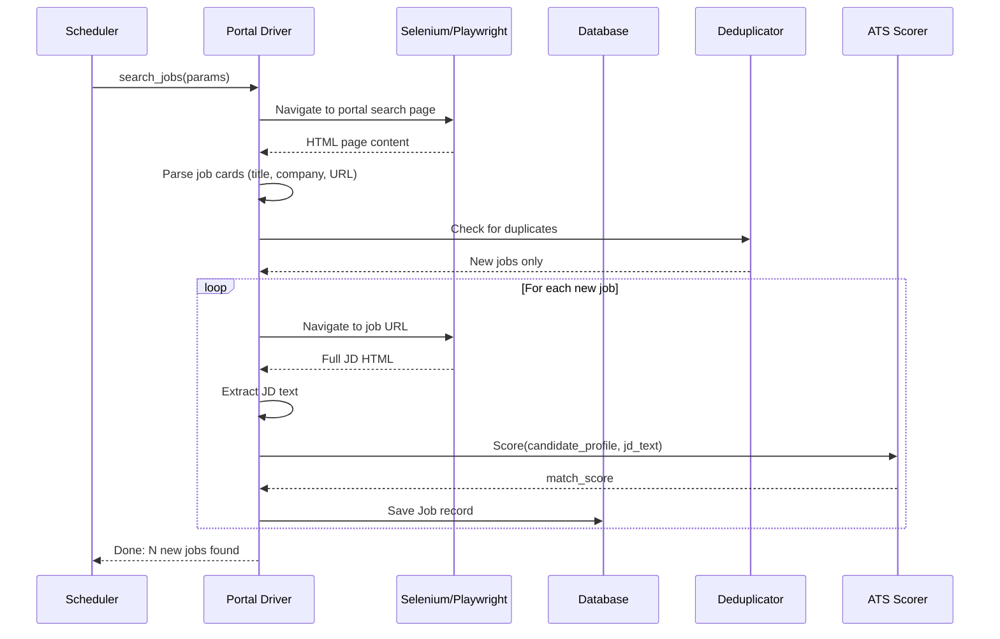

# 04 — Job Discovery Engine

## 1. Purpose

Continuously find relevant jobs across multiple portals, deduplicate, score, and queue them for resume generation and automated application.

---

## 2. Supported Portals

| Portal | Method | Apply Support | Notes |
|---|---|---|---|
| **LinkedIn** | Selenium scraping | Easy Apply | Requires login. Most jobs. |
| **Indeed** | Selenium scraping | Indeed Apply | Large volume, many duplicates |
| **Glassdoor** | Selenium scraping | Easy Apply / Redirect | Often redirects to company ATS |
| **Company Career Pages** | Per-company drivers (Workday, Greenhouse, Lever) | Native forms | Phase 2+ |

---

## 3. Search Configuration

```yaml
# config/search_config.yaml
search_profiles:
  - name: "Backend Engineer Search"
    keywords: ["backend engineer", "python developer", "software engineer"]
    location: "San Francisco, CA"
    radius_miles: 50
    remote_only: false
    date_posted: "past_week"       # past_24h | past_week | past_month
    salary_min: 150000
    experience_level: "senior"     # entry | mid | senior | lead
    job_type: "full_time"          # full_time | part_time | contract
    portals: ["linkedin", "indeed"]

  - name: "Remote ML Engineer"
    keywords: ["machine learning engineer", "ML engineer", "AI engineer"]
    location: "United States"
    remote_only: true
    date_posted: "past_24h"
    portals: ["linkedin", "indeed", "glassdoor"]

schedule:
  interval_hours: 4
  max_jobs_per_run: 100
  quiet_hours: "23:00-07:00"       # Don't scrape during these hours
```

---

## 4. Scraping Architecture

### 4.1 Portal Driver Interface

Every portal implements this interface:

```python
class PortalDriver(ABC):
    """Base class for all job portal scrapers."""

    @abstractmethod
    async def login(self, credentials: dict) -> bool:
        """Authenticate to the portal."""

    @abstractmethod
    async def search_jobs(self, params: SearchParams) -> list[RawJob]:
        """Execute search and return raw job list."""

    @abstractmethod
    async def get_job_details(self, job_url: str) -> JobDetails:
        """Fetch full job description from a listing."""

    @abstractmethod
    async def apply(self, job: Job, resume_path: str, qa_answers: dict) -> ApplicationResult:
        """Submit an application for a specific job."""
```

### 4.2 Scraping Flow



---

## 5. Deduplication Strategy

Jobs appear on multiple portals. We deduplicate by:

1. **Exact URL match** — same URL = same job
2. **Fuzzy title + company match** — "Senior Backend Eng at Acme" on LinkedIn ≈ "Sr. Backend Engineer — Acme Corp" on Indeed
3. **JD text similarity** — if two JDs have >90% text overlap, they're duplicates

```python
def is_duplicate(new_job: Job, existing_jobs: list[Job]) -> bool:
    for existing in existing_jobs:
        # Check 1: URL
        if normalize_url(new_job.url) == normalize_url(existing.url):
            return True
        # Check 2: Title + Company fuzzy
        title_sim = fuzz.ratio(new_job.title.lower(), existing.title.lower())
        company_sim = fuzz.ratio(new_job.company.lower(), existing.company.lower())
        if title_sim > 85 and company_sim > 80:
            return True
        # Check 3: JD text
        if existing.description_text and new_job.description_text:
            jd_sim = text_similarity(new_job.description_text, existing.description_text)
            if jd_sim > 0.90:
                return True
    return False
```

---

## 6. Smart Filtering & Blacklisting

Before scoring, apply filters to discard irrelevant results:

```python
BLACKLIST_RULES = [
    # Company blacklist
    lambda job: job.company.lower() in config.companies_blacklist,
    # Keyword blacklist in title
    lambda job: any(kw in job.title.lower() for kw in config.keywords_blacklist),
    # Staffing agency detection
    lambda job: any(word in job.company.lower() for word in ["staffing", "consulting group", "tek"]),
    # Already applied
    lambda job: job.url in applied_urls,
    # Promoted/sponsored postings (often irrelevant)
    lambda job: job.is_promoted and config.skip_promoted,
]
```

---

## 7. Job Scoring Against Profile

Each discovered job is scored against the full Candidate Profile:

| Factor | Weight | How |
|---|---|---|
| **Skills overlap** | 40% | Intersection of JD required skills and profile skills |
| **Experience years match** | 20% | Profile total years vs. JD requirement |
| **Title relevance** | 20% | Embedding similarity of target_roles to job title |
| **Location/Remote fit** | 10% | Does the job match preferences? |
| **Salary fit** | 10% | Is the salary above min_salary? |

Jobs scoring **≥ 70%** are auto-queued for resume generation and application.
Jobs scoring **50–69%** are flagged for user review.
Jobs scoring **< 50%** are auto-ignored.

---

## 8. Data Model

```python
class Job:
    id: int                     # Auto-increment
    external_id: str            # Portal-specific ID
    title: str
    company: str
    location: str
    salary_range: str | None
    description_text: str       # Full JD
    url: str
    source: str                 # "linkedin" | "indeed" | "glassdoor"
    match_score: float          # 0-100
    status: str                 # NEW | QUEUED | APPLIED | SKIPPED | FAILED
    discovered_at: datetime
    applied_at: datetime | None
    resume_path: str | None     # Path to tailored resume used
    notes: str | None           # Failure reason, etc.
```
