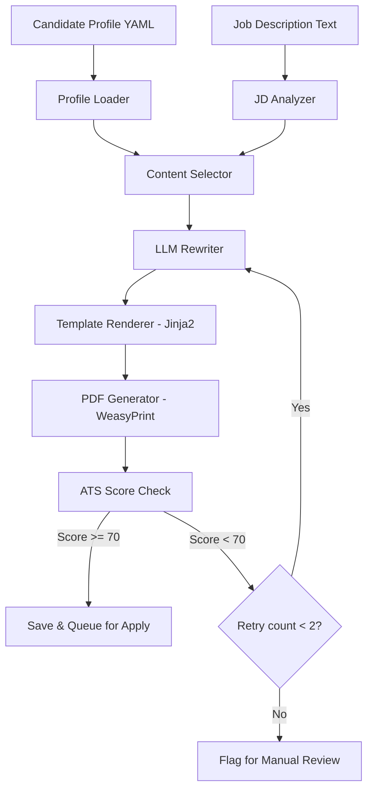

# 05 — Resume Generation Engine

## 1. Purpose

For **every** job the system decides to apply to, it generates a **unique, ATS-optimized PDF resume** tailored to that specific job description — using the rich Candidate Profile as source material.

---

## 2. End-to-End Generation Pipeline



---

## 3. Stage 1: JD Analysis

Extract structured intelligence from the job description:

```python
class JDAnalysis:
    required_skills: list[str]       # "Python", "AWS", "Kubernetes"
    preferred_skills: list[str]      # "Go", "Terraform"
    years_experience: int | None     # 5
    education_requirement: str       # "BS in CS or equivalent"
    responsibilities: list[str]      # Key responsibility sentences
    company_values: list[str]        # "fast-paced", "collaborative"
    industry_keywords: list[str]     # "fintech", "payments"
```

**Method**: LLM extraction (prompt the LLM with the full JD, ask for structured JSON output).

---

## 4. Stage 2: Content Selection

Given the JD analysis, select the most relevant content from the Candidate Profile.

### 4.1 Skills Selection
```
1. Take all JD required_skills
2. Find matches in profile.skills (exact, fuzzy, alias)
3. Order: exact matches first, then fuzzy, then related
4. Cap at template limit (e.g., 15 skills for a 1-page resume)
5. If space allows, add preferred_skills matches
```

### 4.2 Experience Bullet Selection
```
For each role in profile.experience:
    1. Compute relevance score for each bullet against JD
       - Embedding similarity (bullet text ↔ JD responsibilities)
       - Tag overlap (bullet.tags ∩ JD required_skills)
    2. Rank bullets by relevance score
    3. Select top N bullets (e.g., 4 for most recent role, 3 for older roles)
    4. Ensure diversity — don't pick 4 bullets all about the same topic
```

### 4.3 Project Selection
```
1. Score each project against JD (tech_stack overlap, tag overlap)
2. Select top 2 projects
3. If candidate has few matching projects, skip projects section entirely
```

### 4.4 Summary Generation
```
1. Check if any profile.summaries[].target_role matches the JD title
2. If match found → use as base, ask LLM to refine with specific JD keywords
3. If no match → ask LLM to generate a new summary using:
   - Candidate's top skills matching JD
   - Years of experience
   - Most relevant achievements
   - JD company values / keywords
```

---

## 5. Stage 3: LLM Rewriting

The LLM is used for two tasks:

### 5.1 Summary Rewriting
```
Prompt:
  You are an expert resume writer. Write a 3-sentence professional summary for a
  candidate applying to this role:

  Job Title: {jd.title}
  Company: {jd.company}
  Key Requirements: {jd.required_skills}

  Candidate Info:
  - {experience_years} years of experience
  - Top skills: {selected_skills}
  - Recent achievement: {top_bullet}

  Rules:
  - Include these keywords naturally: {missing_keywords}
  - Do NOT fabricate experience
  - Keep it under 60 words
  - Use active voice
```

### 5.2 Bullet Point Enhancement (Optional)
If a bullet is relevant but doesn't include a JD keyword, the LLM can rephrase:

```
Original: "Built a caching layer that improved response times"
JD keyword needed: "Redis"
Profile confirms: candidate knows Redis

Enhanced: "Built a Redis-based caching layer that improved API response times by 60%"
```

> [!CAUTION]
> LLM rewriting is **constrained** — it can only rephrase using facts from the Candidate Profile. It cannot add skills or experiences not present in the profile.

---

## 6. Stage 4: Template Rendering

### 6.1 Template System
- Templates are HTML + CSS files processed by **Jinja2**
- ATS-friendly: no tables for layout, no columns, no images, standard fonts
- Single-column layout with clear section headers

### 6.2 Available Templates

| Template | Use Case | Layout |
|---|---|---|
| `classic.html` | Default, works everywhere | Single column, serif font |
| `modern.html` | Tech roles | Single column, sans-serif, subtle color |
| `compact.html` | 1-page strict | Tighter spacing, smaller font |

### 6.3 Template Structure
```html
<!DOCTYPE html>
<html>
<head><style>{{ css }}</style></head>
<body>
  <header>
    <h1>{{ name }}</h1>
    <p>{{ email }} | {{ phone }} | {{ location }}</p>
    <p>{{ linkedin }} | {{ github }}</p>
  </header>

  <section id="summary">
    <h2>Professional Summary</h2>
    <p>{{ summary }}</p>
  </section>

  <section id="skills">
    <h2>Technical Skills</h2>
    <p>{{ skills | join(", ") }}</p>
  </section>

  <section id="experience">
    <h2>Professional Experience</h2>
    
    <div class="role">
      <h3>{{ role.title }} — {{ role.company }}</h3>
      <span>{{ role.dates }} | {{ role.location }}</span>
      <ul>
        
        <li>{{ bullet }}</li>
        
      </ul>
    </div>
    
  </section>

  <!-- Education, Certifications, Projects as needed -->
</body>
</html>
```

---

## 7. Stage 5: PDF Generation

```python
from weasyprint import HTML

def generate_pdf(html_content: str, output_path: str):
    HTML(string=html_content).write_pdf(output_path)
```

**Output**: `data/resumes/generated/resume_job_{job_id}.pdf`

---

## 8. Stage 6: Quality Gate (ATS Re-Score)

After generation, the resume is scored against the JD using the ATS Analysis Engine:

- **Score ≥ 70%** → Proceed to application
- **Score < 70%** → Retry generation with adjusted content (max 2 retries)
- **After 2 retries, still < 70%** → Flag for manual review

This creates a **closed feedback loop** ensuring every submitted resume is optimized.

---

## 9. Caching & Efficiency

To avoid redundant LLM calls:

- **Similar JDs** — if a new JD is >90% similar to a previously processed JD, reuse the same resume
- **Summary cache** — cache generated summaries by `(target_role, top_5_keywords)` tuple
- **Batch processing** — generate resumes for multiple jobs in parallel (thread pool)
