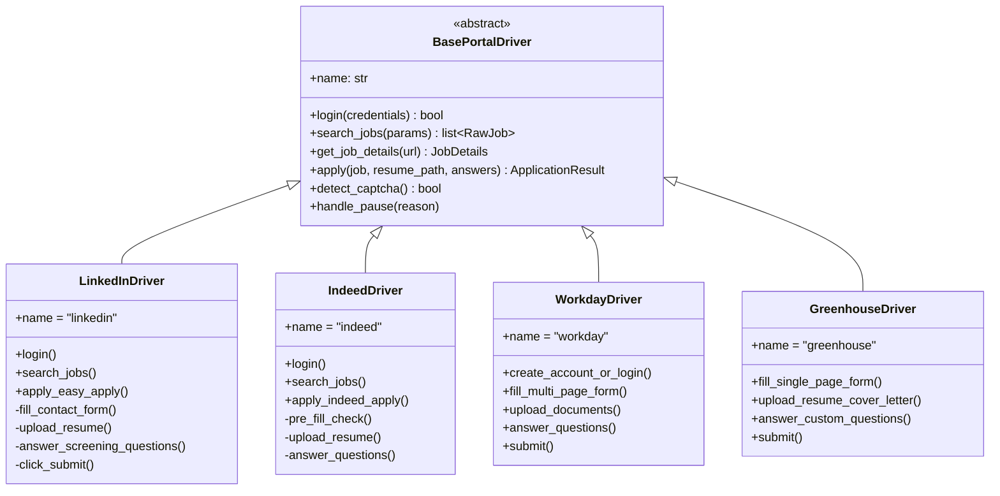
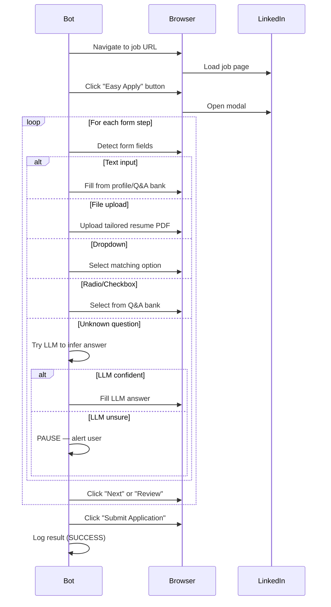
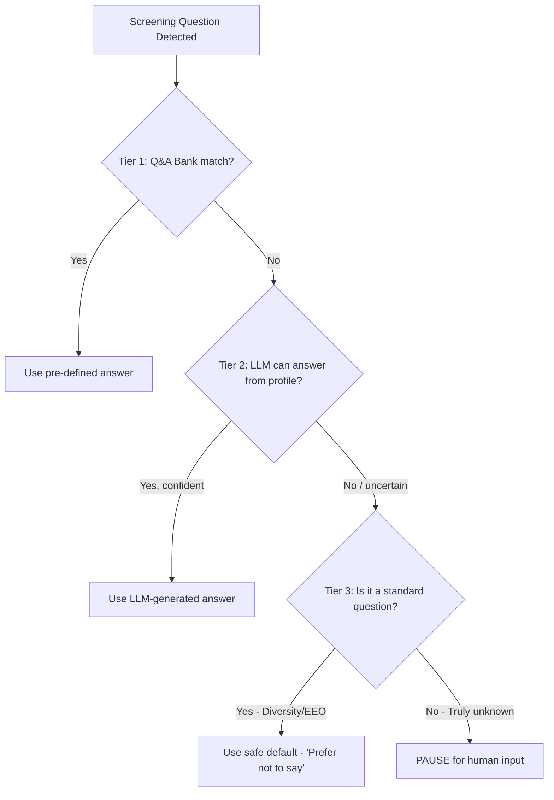
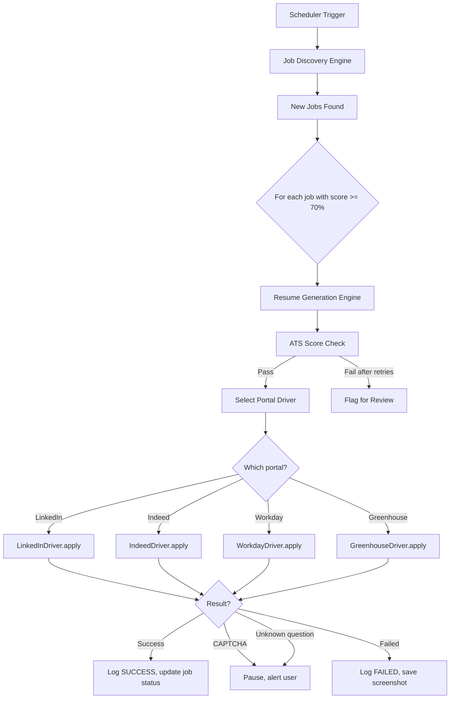

# 06 — Application Automation Engine

## 1. Purpose

This is the most complex engine — it must **navigate different job portals**, each with unique UIs and form flows and **submit applications without human involvement**. This document defines the complete strategy.

---

## 2. The Core Challenge

Every portal has a different application flow:

| Portal | Flow Type | Steps |
|---|---|---|
| **LinkedIn Easy Apply** | Multi-step modal | Click "Easy Apply" → Contact Info → Resume Upload → Screening Qs → Review → Submit |
| **Indeed Apply** | Inline form | Click "Apply" → Pre-filled from profile → Resume → Questions → Submit |
| **Glassdoor** | Redirect | Often redirects to company ATS (Workday, Greenhouse, etc.) |
| **Workday** | Full external form | Create account (or login) → Multi-page form → Upload → Questions → Submit |
| **Greenhouse** | External form | Single-page form → Name, email, resume, cover letter, custom questions |
| **Lever** | External form | Similar to Greenhouse, single-page with resume parsing |
| **Company websites** | Anything | Wildcard — completely custom forms |

---

## 3. Portal Driver Plugin System

### 3.1 Architecture



### 3.2 Adding a New Portal

To support a new portal, create a new driver class:

```python
# drivers/naukri_driver.py
class NaukriDriver(BasePortalDriver):
    name = "naukri"

    async def login(self, credentials):
        # Naukri-specific login flow
        ...

    async def apply(self, job, resume_path, answers):
        # Naukri-specific form filling
        ...
```

Register it in the driver registry:

```python
PORTAL_DRIVERS = {
    "linkedin": LinkedInDriver,
    "indeed": IndeedDriver,
    "workday": WorkdayDriver,
    "greenhouse": GreenhouseDriver,
    "naukri": NaukriDriver,  # Just add the line
}
```

---

## 4. Detailed Application Flows

### 4.1 LinkedIn Easy Apply



**Key selectors** (stored in `config/selectors/linkedin.yaml`):
```yaml
linkedin:
  easy_apply_button: "button.jobs-apply-button"
  modal_container: "div.jobs-easy-apply-modal"
  next_button: "button[aria-label='Continue to next step']"
  review_button: "button[aria-label='Review your application']"
  submit_button: "button[aria-label='Submit application']"
  resume_upload: "input[type='file']"
  text_input: "input[type='text'], textarea"
  dropdown: "select"
  radio: "input[type='radio']"
  error_message: "div.artdeco-inline-feedback"
```

### 4.2 Indeed Apply

```
1. Navigate to job URL
2. Click "Apply now" button
3. Indeed shows pre-filled form (from Indeed profile)
4. Check each field — override with our data if needed
5. Upload resume
6. Answer screening questions (if any)
7. Click "Submit your application"
8. Log result
```

### 4.3 Workday (Enterprise ATS)

Workday is more complex:
```
1. Redirect from job board → company Workday URL
2. Check if we have an account → Login or Create Account
   - Account creation: email, password, name
   - Store credentials in encrypted vault
3. Navigate to job → Click "Apply"
4. Multi-page form:
   - Page 1: Personal Info (pre-fill from profile)
   - Page 2: Experience (may ask to re-enter manually)
   - Page 3: Education
   - Page 4: Resume upload + Cover letter (optional)
   - Page 5: Diversity questions (skip or answer default)
   - Page 6: Review & Submit
5. Log result
```

### 4.4 Greenhouse / Lever

These are simpler — typically single-page forms:
```
1. Navigate to application URL
2. Fill: First Name, Last Name, Email, Phone
3. Upload Resume
4. Upload Cover Letter (if required — generate one)
5. Answer custom questions (text fields, dropdowns)
6. Click "Submit Application"
7. Log result
```

---

## 5. Intelligent Question Answering

### 5.1 Three-Tier Answer Strategy



### 5.2 Q&A Matching

```python
def find_answer(question_text: str, qa_bank: list[QAEntry]) -> str | None:
    """Match a question against the Q&A bank using fuzzy matching."""
    for entry in qa_bank:
        # Regex pattern match
        if re.search(entry.question_pattern, question_text, re.IGNORECASE):
            return entry.answer

    # Embedding similarity fallback
    question_embedding = embed(question_text)
    for entry in qa_bank:
        similarity = cosine_sim(question_embedding, embed(entry.question_pattern))
        if similarity > 0.85:
            return entry.answer

    return None  # No match — escalate
```

### 5.3 LLM Fallback

```python
def llm_answer_question(question: str, profile: CandidateProfile) -> tuple[str, float]:
    """Ask LLM to answer based on candidate profile. Returns (answer, confidence)."""
    prompt = f"""
    A job application asks: "{question}"

    Candidate profile summary:
    - Experience: {profile.total_years} years
    - Skills: {profile.top_skills}
    - Education: {profile.education_summary}

    Answer this question truthfully based on the profile.
    If you cannot determine the answer from the profile, say "UNKNOWN".

    Respond with JSON: {{"answer": "...", "confidence": 0.0-1.0}}
    """
    result = llm.generate(prompt)
    if result.confidence >= 0.8:
        return result.answer, result.confidence
    return None, result.confidence
```

---

## 6. Anti-Detection & Safety

### 6.1 Human-Like Behavior

```python
class HumanSimulator:
    """Adds realistic delays and behaviors to avoid bot detection."""

    def random_delay(self, min_sec=2, max_sec=6):
        time.sleep(random.uniform(min_sec, max_sec))

    def type_slowly(self, element, text):
        for char in text:
            element.send_keys(char)
            time.sleep(random.uniform(0.05, 0.15))

    def random_scroll(self, driver):
        scroll_amount = random.randint(100, 500)
        driver.execute_script(f"window.scrollBy(0, {scroll_amount})")
        self.random_delay(0.5, 1.5)

    def random_mouse_move(self, driver, element):
        # Move to element with random offset
        action = ActionChains(driver)
        offset_x = random.randint(-5, 5)
        offset_y = random.randint(-5, 5)
        action.move_to_element_with_offset(element, offset_x, offset_y).perform()
```

### 6.2 Rate Limiting

```yaml
# config/safety.yaml
rate_limits:
  daily_applications:
    linkedin: 25        # Max 25 LinkedIn apps/day
    indeed: 30
    workday: 10
    total: 50           # Hard cap across all portals

  delays:
    between_applications_sec: [60, 180]   # 1-3 min between apps
    between_searches_sec: [30, 90]
    between_page_actions_sec: [2, 6]

  session:
    max_duration_hours: 3                  # Take a break after 3 hours
    break_duration_min: [30, 60]           # 30-60 min break
```

### 6.3 CAPTCHA Handling

```python
class CaptchaHandler:
    def detect(self, driver) -> bool:
        """Check if a CAPTCHA is present on the page."""
        captcha_indicators = [
            "//iframe[contains(@src, 'recaptcha')]",
            "//div[contains(@class, 'captcha')]",
            "//div[@id='challenge-stage']",
        ]
        for xpath in captcha_indicators:
            if driver.find_elements(By.XPATH, xpath):
                return True
        return False

    def handle(self, driver, job_id: int):
        """Pause automation and alert user."""
        logger.warning(f"CAPTCHA detected for job {job_id}")
        # Save screenshot
        driver.save_screenshot(f"captcha_{job_id}.png")
        # Send notification
        notify_user(
            method="telegram",  # or email, desktop notification
            message=f"CAPTCHA encountered for job {job_id}. Please solve manually.",
            screenshot=f"captcha_{job_id}.png"
        )
        # Wait for user to solve (poll every 10 sec)
        while self.detect(driver):
            time.sleep(10)
        logger.info("CAPTCHA resolved. Resuming.")
```

---

## 7. Application Result Logging

Every application attempt is logged:

```python
class ApplicationResult:
    job_id: int
    portal: str
    status: str           # SUCCESS | FAILED | SKIPPED | MANUAL_NEEDED
    error_message: str | None
    screenshot_path: str | None  # Screenshot on failure
    resume_used: str             # Path to resume PDF used
    questions_answered: list[dict]  # {question, answer, source}
    duration_seconds: float
    timestamp: datetime
```

---

## 8. Orchestration Flow (Putting It All Together)


