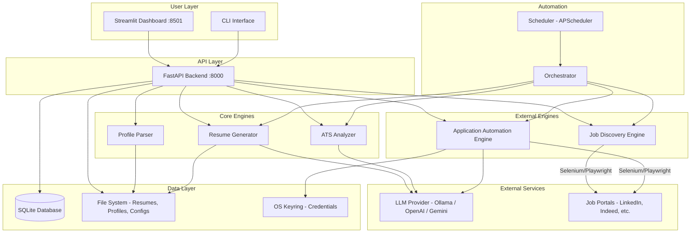
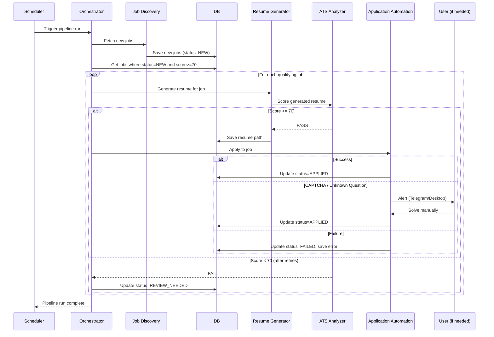

# 07 — High-Level Architecture

## 1. System Overview

The ATS Optimizer is a **locally-running Python application** with five main engines coordinated by a central orchestrator, a SQLite database, and a Streamlit dashboard.

---

## 2. Architecture Diagram



---

## 3. Component Responsibilities

| Component | Responsibility |
|---|---|
| **FastAPI Backend** | REST API. All user-facing operations go through here. |
| **Streamlit Dashboard** | Read-only views + trigger actions via API. No direct DB access. |
| **CLI** | Power-user alternative to the dashboard. Same API calls. |
| **Orchestrator** | The "brain" — coordinates the full pipeline: discover → score → generate → apply. |
| **Scheduler** | Cron-like triggers for periodic job discovery and application runs. |
| **Profile Parser** | Imports resume PDF/DOCX → extracts structured data → populates profile. |
| **ATS Analyzer** | Scores resume text vs. JD text. Suggests improvements. |
| **Resume Generator** | Selects profile content, uses LLM, renders HTML → PDF. |
| **Job Discovery Engine** | Manages portal drivers for scraping. Deduplicates. Scores. |
| **Application Automation Engine** | Manages portal drivers for applying. Fills forms. Handles errors. |
| **LLM Provider** | Abstracted interface — can switch between Ollama (local), OpenAI, or Gemini. |

---

## 4. Data Flow: Full Pipeline



---

## 5. Technology Stack

| Layer | Technology | Why |
|---|---|---|
| **Backend API** | FastAPI | Async, fast, automatic OpenAPI docs |
| **Dashboard** | Streamlit | Rapid Python UI, no frontend build step |
| **Database** | SQLite + SQLAlchemy | Zero setup, local, sufficient for single-user |
| **Browser Automation** | Playwright (preferred) or Selenium | Playwright: faster, better async, auto-wait |
| **Resume Parsing** | pdfminer.six + spaCy | pdfminer for PDF text, spaCy for NER |
| **Resume Rendering** | Jinja2 + WeasyPrint | HTML→PDF with full CSS support |
| **LLM** | Ollama (local) / OpenAI API / Gemini API | Ollama for free/private, APIs for quality |
| **NLP** | spaCy + sentence-transformers | Keyword extraction + semantic similarity |
| **Scheduler** | APScheduler | Python-native, cron-like scheduling |
| **Config** | YAML files | Human-readable, git-friendly |
| **Credentials** | OS keyring (keyring lib) | Secure local credential storage |
| **Notifications** | Telegram Bot API / Desktop toast | Alert user on CAPTCHA / errors |

---

## 6. Directory Structure

```
ats-optimizer/
├── docs/                           # This documentation
│
├── src/
│   ├── __init__.py
│   ├── main.py                     # FastAPI app entry point
│   ├── cli.py                      # CLI commands (Click/Typer)
│   ├── config.py                   # Load YAML configs
│   ├── database.py                 # SQLAlchemy setup
│   ├── models.py                   # DB models (Job, Resume, Log)
│   ├── schemas.py                  # Pydantic request/response models
│   │
│   ├── profile/
│   │   ├── __init__.py
│   │   ├── parser.py               # PDF/DOCX → structured data
│   │   ├── manager.py              # CRUD for candidate profile
│   │   └── enricher.py             # Guided questions to fill gaps
│   │
│   ├── analyzer/
│   │   ├── __init__.py
│   │   ├── scorer.py               # ATS scoring algorithm
│   │   ├── keywords.py             # Keyword extraction (spaCy)
│   │   └── suggestions.py          # Improvement suggestions
│   │
│   ├── discovery/
│   │   ├── __init__.py
│   │   ├── manager.py              # Orchestrates multi-portal search
│   │   ├── deduplicator.py         # Deduplication logic
│   │   └── scorer.py               # Job-profile match scoring
│   │
│   ├── generator/
│   │   ├── __init__.py
│   │   ├── content_selector.py     # Pick best bullets/skills
│   │   ├── llm_rewriter.py         # LLM summary/bullet rewriting
│   │   ├── renderer.py             # Jinja2 → HTML → PDF
│   │   └── templates/
│   │       ├── classic.html
│   │       ├── modern.html
│   │       └── styles.css
│   │
│   ├── automation/
│   │   ├── __init__.py
│   │   ├── orchestrator.py         # Full pipeline coordinator
│   │   ├── question_answerer.py    # Q&A bank + LLM fallback
│   │   ├── human_simulator.py      # Anti-detection delays
│   │   ├── captcha_handler.py      # Detect + pause + alert
│   │   └── drivers/
│   │       ├── __init__.py
│   │       ├── base.py             # BasePortalDriver ABC
│   │       ├── linkedin.py
│   │       ├── indeed.py
│   │       ├── workday.py
│   │       └── greenhouse.py
│   │
│   ├── llm/
│   │   ├── __init__.py
│   │   ├── provider.py             # Abstract LLM interface
│   │   ├── ollama_provider.py      # Local LLM via Ollama
│   │   ├── openai_provider.py      # OpenAI API
│   │   └── gemini_provider.py      # Google Gemini API
│   │
│   └── notifications/
│       ├── __init__.py
│       ├── telegram.py
│       └── desktop.py
│
├── config/
│   ├── search_config.yaml          # Job search parameters
│   ├── safety.yaml                 # Rate limits, delays
│   └── selectors/
│       ├── linkedin.yaml           # CSS/XPath selectors (not hardcoded)
│       ├── indeed.yaml
│       ├── workday.yaml
│       └── greenhouse.yaml
│
├── data/
│   ├── profiles/
│   │   └── candidate_profile.yaml
│   ├── qa_bank.yaml
│   └── resumes/
│       ├── generated/
│       └── templates/
│
├── frontend/
│   └── dashboard.py                # Streamlit app
│
├── tests/
│   ├── test_analyzer.py
│   ├── test_generator.py
│   ├── test_discovery.py
│   └── test_automation.py
│
├── requirements.txt
└── README.md
```
