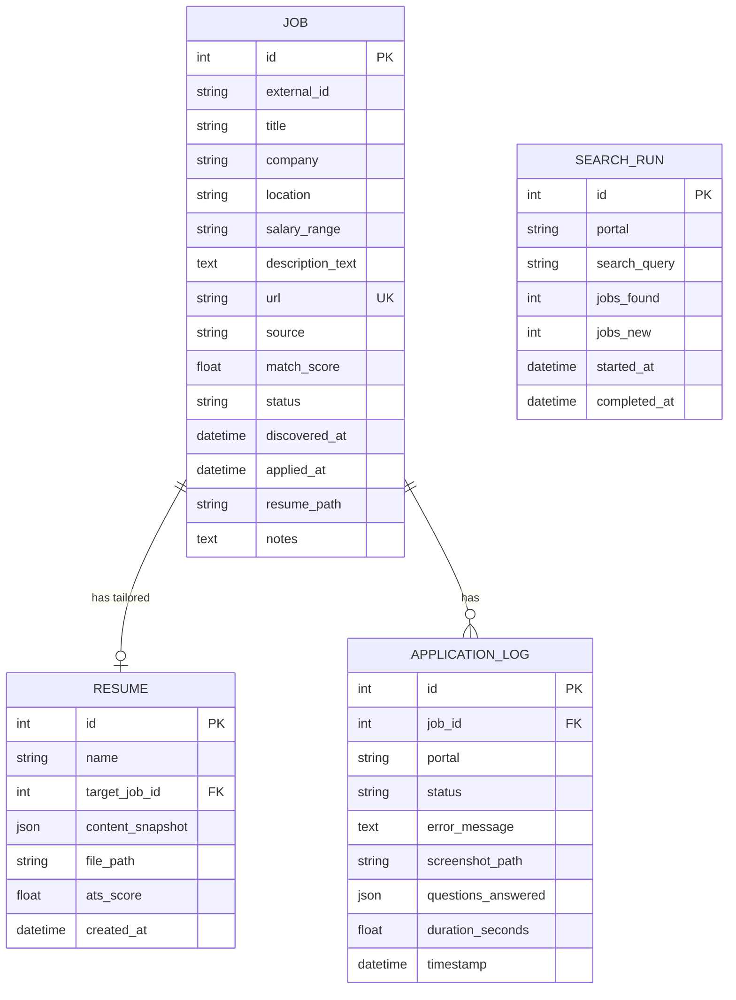

# 08 — Low-Level Design

## 1. Database Schema (SQLAlchemy Models)

### 1.1 Entity Relationship Diagram



---

## 2. Pydantic Schemas (API Request/Response Models)

```python
# schemas.py

class JobResponse(BaseModel):
    id: int
    title: str
    company: str
    location: str | None
    url: str
    source: str
    match_score: float
    status: str
    discovered_at: datetime

class JobListResponse(BaseModel):
    total: int
    jobs: list[JobResponse]

class AnalyzeRequest(BaseModel):
    resume_text: str
    job_description: str

class AnalyzeResponse(BaseModel):
    overall_score: int
    breakdown: dict[str, int]
    missing_keywords: list[dict]
    suggestions: list[str]
    formatting_issues: list[str]

class ProfileUpdateRequest(BaseModel):
    section: str                   # "skills" | "experience" | "education" | ...
    data: dict                     # Section-specific data

class ApplyRequest(BaseModel):
    job_ids: list[int]             # Jobs to apply to
    dry_run: bool = False          # If true, simulate without submitting

class ApplyResponse(BaseModel):
    results: list[dict]            # [{job_id, status, message}]

class PipelineStatusResponse(BaseModel):
    is_running: bool
    current_phase: str | None      # "discovery" | "generation" | "applying"
    jobs_processed: int
    jobs_applied: int
    jobs_failed: int
    started_at: datetime | None
```

---

## 3. API Endpoints

| Method | Path | Description |
|---|---|---|
| **Profile** | | |
| `GET` | `/profile` | Get current candidate profile |
| `PUT` | `/profile` | Update a profile section |
| `POST` | `/profile/import` | Upload resume PDF/DOCX → parse into profile |
| **Analysis** | | |
| `POST` | `/analyze/score` | Score resume text vs. JD text |
| `POST` | `/analyze/suggestions` | Get improvement suggestions |
| **Jobs** | | |
| `GET` | `/jobs` | List jobs (filterable: status, score, portal) |
| `GET` | `/jobs/{id}` | Get job details |
| `PATCH` | `/jobs/{id}` | Update job status (e.g., mark as IGNORED) |
| `POST` | `/jobs/search` | Trigger manual job search |
| **Resumes** | | |
| `GET` | `/resumes` | List generated resumes |
| `GET` | `/resumes/{id}/download` | Download a generated PDF |
| `POST` | `/resumes/generate` | Generate resume for a specific job |
| **Applications** | | |
| `POST` | `/apply` | Apply to specific job(s) |
| `GET` | `/applications` | List application logs |
| **Pipeline** | | |
| `POST` | `/pipeline/start` | Start full automated pipeline |
| `POST` | `/pipeline/stop` | Stop running pipeline |
| `GET` | `/pipeline/status` | Get current pipeline status |
| **Config** | | |
| `GET` | `/config/search` | Get search configuration |
| `PUT` | `/config/search` | Update search configuration |
| `GET` | `/config/safety` | Get safety/rate-limit settings |
| `PUT` | `/config/safety` | Update safety settings |

---

## 4. Core Class Interfaces

### 4.1 Profile Module

```python
class ProfileManager:
    def load(self) -> CandidateProfile:
        """Load profile from YAML file."""

    def save(self, profile: CandidateProfile):
        """Save profile to YAML file."""

    def update_section(self, section: str, data: dict):
        """Update a specific section (skills, experience, etc.)."""

    def import_from_resume(self, file_path: str) -> CandidateProfile:
        """Parse PDF/DOCX and create initial profile draft."""

class ResumeImporter:
    def parse_pdf(self, path: str) -> str:
        """Extract raw text from PDF using pdfminer."""

    def parse_docx(self, path: str) -> str:
        """Extract text from DOCX using python-docx."""

    def extract_entities(self, text: str) -> dict:
        """Use spaCy NER to extract structured data."""
```

### 4.2 Analyzer Module

```python
class ATSScorer:
    def score(self, resume_text: str, jd_text: str) -> ScoreResult:
        """Calculate ATS compatibility score (0-100)."""

class KeywordExtractor:
    def extract(self, text: str) -> list[Keyword]:
        """Extract keywords using spaCy noun chunks + NER."""

    def extract_with_importance(self, jd_text: str) -> list[ScoredKeyword]:
        """Extract keywords with importance weight based on frequency and position."""

class SuggestionEngine:
    def suggest(self, score_result: ScoreResult, profile: CandidateProfile) -> list[Suggestion]:
        """Generate actionable suggestions to improve ATS score."""
```

### 4.3 Discovery Module

```python
class DiscoveryManager:
    def __init__(self, drivers: dict[str, BasePortalDriver]):
        self.drivers = drivers

    async def run_search(self, config: SearchConfig) -> list[Job]:
        """Execute search across all configured portals."""

    async def score_jobs(self, jobs: list[Job], profile: CandidateProfile):
        """Score each job against the candidate profile."""

class Deduplicator:
    def deduplicate(self, new_jobs: list[Job], existing_jobs: list[Job]) -> list[Job]:
        """Return only truly new jobs."""
```

### 4.4 Generator Module

```python
class ContentSelector:
    def select(self, profile: CandidateProfile, jd_analysis: JDAnalysis) -> ResumeContent:
        """Pick the most relevant skills, bullets, projects for this JD."""

class LLMRewriter:
    def rewrite_summary(self, profile: CandidateProfile, jd: JDAnalysis) -> str:
        """Generate a tailored professional summary."""

    def enhance_bullet(self, bullet: str, keywords: list[str], profile: CandidateProfile) -> str:
        """Optionally rephrase a bullet to include missing keywords."""

class ResumeRenderer:
    def render_html(self, content: ResumeContent, template: str) -> str:
        """Render Jinja2 template with selected content."""

    def render_pdf(self, html: str, output_path: str):
        """Convert HTML to PDF using WeasyPrint."""
```

### 4.5 Automation Module

```python
class Orchestrator:
    """Coordinates the full pipeline: discover → score → generate → apply."""

    def __init__(self, discovery, generator, analyzer, drivers, config):
        ...

    async def run_pipeline(self):
        """Execute one full pipeline run."""
        jobs = await self.discovery.run_search(self.config.search)
        for job in jobs:
            if job.match_score >= self.config.auto_apply_threshold:
                resume = await self.generator.generate(job)
                score = self.analyzer.score(resume.text, job.description_text)
                if score.overall >= self.config.min_ats_score:
                    driver = self.drivers[job.source]
                    result = await driver.apply(job, resume.file_path, self.qa_bank)
                    self.log_result(result)

class QuestionAnswerer:
    def answer(self, question: str) -> tuple[str | None, str]:
        """Returns (answer, source) where source is 'qa_bank' | 'llm' | 'default'."""

class HumanSimulator:
    def delay(self, min_sec: float, max_sec: float): ...
    def type_slowly(self, element, text): ...
    def random_scroll(self, driver): ...
```

---

## 5. Configuration Files

### 5.1 Main Config (`config/app.yaml`)

```yaml
app:
  name: "ATS Optimizer"
  version: "1.0.0"

database:
  url: "sqlite:///data/ats_optimizer.db"

llm:
  provider: "ollama"           # ollama | openai | gemini
  model: "llama3"              # Model name
  api_key: null                # Only for cloud providers
  base_url: "http://localhost:11434"

browser:
  engine: "playwright"         # playwright | selenium
  headless: true               # false for debugging
  user_data_dir: "data/browser_profiles"

notifications:
  enabled: true
  method: "desktop"            # desktop | telegram | email
  telegram_bot_token: null
  telegram_chat_id: null
```

### 5.2 Selectors Config (`config/selectors/linkedin.yaml`)

```yaml
# Externalized selectors — easy to update when LinkedIn changes its DOM
login:
  username_input: "#username"
  password_input: "#password"
  login_button: "button[type='submit']"

search:
  search_box: "input[id='jobs-search-box-keyword-id-ember']"
  location_box: "input[id='jobs-search-box-location-id-ember']"
  easy_apply_filter: "button[aria-label='Easy Apply filter']"
  job_cards: "div.job-card-container"
  job_title: "a.job-card-list__title"
  job_company: "span.job-card-container__primary-description"

easy_apply:
  apply_button: "button.jobs-apply-button"
  modal: "div.jobs-easy-apply-modal"
  next_button: "button[aria-label='Continue to next step']"
  review_button: "button[aria-label='Review your application']"
  submit_button: "button[aria-label='Submit application']"
  close_button: "button[aria-label='Dismiss']"
  file_input: "input[type='file']"
  text_inputs: "input[type='text']:not([readonly]), textarea"
  select_inputs: "select"
  radio_inputs: "fieldset input[type='radio']"
  error_banner: "div.artdeco-inline-feedback--error"
```

---

## 6. Error Handling Strategy

| Error Type | Handling |
|---|---|
| **Network timeout** | Retry 3 times with exponential backoff (2s, 4s, 8s) |
| **Element not found** | Screenshot + log. Skip this job, continue pipeline. |
| **Login failed** | Alert user. Pause pipeline. |
| **CAPTCHA** | Screenshot + alert. Wait for manual solve. |
| **Rate limited / blocked** | Pause pipeline for configured break duration. |
| **LLM error** | Retry once. If fails, use template summary (no LLM). |
| **PDF generation error** | Log error. Skip this job. |
| **Database error** | Critical — stop pipeline, alert user. |
