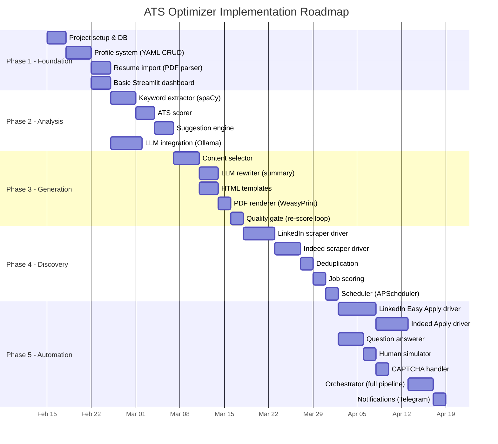

# 09 — Implementation Roadmap

## 1. Phased Approach

The project is divided into **5 phases**, each producing a usable increment. Each phase builds on the previous one.

---

## 2. Phase Overview

---

## 3. Phase Details

### Phase 1: Foundation (Week 1–2)

**Goal**: Set up the project, implement the Candidate Profile system, and create a basic dashboard.

| Task | Files | Dependencies |
|---|---|---|
| Project skeleton (FastAPI, SQLAlchemy, configs) | `src/main.py`, `src/database.py`, `src/models.py`, `requirements.txt` | None |
| Candidate Profile YAML schema & manager | `src/profile/manager.py` | None |
| Resume import (PDF → structured data) | `src/profile/parser.py` | pdfminer.six, spaCy |
| Q&A bank management | `data/qa_bank.yaml`, `src/profile/manager.py` | Profile manager |
| Basic Streamlit dashboard (profile view, job list) | `frontend/dashboard.py` | FastAPI running |

**Deliverable**: User can create a profile, import a resume, and view it in the dashboard.

---

### Phase 2: Analysis Engine (Week 2–3)

**Goal**: Score resumes against JDs and provide improvement suggestions.

| Task | Files | Dependencies |
|---|---|---|
| Keyword extractor (spaCy NER + noun chunks) | `src/analyzer/keywords.py` | spaCy model |
| ATS scoring algorithm (5-component weighted) | `src/analyzer/scorer.py` | Keyword extractor |
| Improvement suggestion engine | `src/analyzer/suggestions.py` | Scorer |
| LLM provider abstraction + Ollama integration | `src/llm/provider.py`, `src/llm/ollama_provider.py` | Ollama installed |
| API endpoints for analysis | `src/main.py` | Scorer |

**Deliverable**: User can paste a JD, get a score, and see suggestions.

---

### Phase 3: Resume Generation (Week 3–4)

**Goal**: Generate tailored PDFs for specific jobs.

| Task | Files | Dependencies |
|---|---|---|
| JD analysis (extract required skills, responsibilities) | `src/generator/content_selector.py` | LLM provider |
| Content selector (pick bullets, skills from profile) | `src/generator/content_selector.py` | Profile, keyword extractor |
| LLM summary rewriter | `src/generator/llm_rewriter.py` | LLM provider |
| HTML templates (classic, modern) | `src/generator/templates/*.html` | None |
| WeasyPrint PDF renderer | `src/generator/renderer.py` | WeasyPrint |
| Quality gate (score → retry loop) | `src/generator/renderer.py` | ATS scorer |

**Deliverable**: Given a JD, system generates a tailored, ATS-scored PDF.

---

### Phase 4: Job Discovery (Week 4–5)

**Goal**: Automatically find relevant jobs across portals.

| Task | Files | Dependencies |
|---|---|---|
| BasePortalDriver interface | `src/automation/drivers/base.py` | None |
| LinkedIn search driver | `src/automation/drivers/linkedin.py` | Playwright |
| Indeed search driver | `src/automation/drivers/indeed.py` | Playwright |
| Deduplication engine | `src/discovery/deduplicator.py` | fuzzywuzzy |
| Job-profile match scoring | `src/discovery/scorer.py` | Keyword extractor |
| APScheduler integration | `src/main.py` | APScheduler |
| Search config YAML | `config/search_config.yaml` | None |

**Deliverable**: System auto-discovers jobs on a schedule and scores them.

---

### Phase 5: Application Automation (Week 5–7)

**Goal**: Apply to jobs automatically.

| Task | Files | Dependencies |
|---|---|---|
| LinkedIn Easy Apply flow | `src/automation/drivers/linkedin.py` | LinkedIn search driver |
| Indeed Apply flow | `src/automation/drivers/indeed.py` | Indeed search driver |
| Question answerer (Q&A bank + LLM) | `src/automation/question_answerer.py` | Q&A bank, LLM |
| Human simulator (delays, typing) | `src/automation/human_simulator.py` | None |
| CAPTCHA detector & handler | `src/automation/captcha_handler.py` | Notifications |
| Orchestrator (full pipeline) | `src/automation/orchestrator.py` | All engines |
| Selector configs (externalized) | `config/selectors/*.yaml` | None |
| Safety config (rate limits) | `config/safety.yaml` | None |
| Telegram notifications | `src/notifications/telegram.py` | Telegram bot |
| Enhanced dashboard (pipeline control) | `frontend/dashboard.py` | All APIs |

**Deliverable**: Full autonomous pipeline — discover → score → generate → apply.

---

## 4. Tech Stack Summary

| Component | Choice | Alternative |
|---|---|---|
| Language | Python 3.11+ | — |
| Backend API | FastAPI | Flask |
| Dashboard | Streamlit | Gradio |
| Database | SQLite + SQLAlchemy | PostgreSQL (if scaling) |
| Browser | Playwright | Selenium |
| Resume PDF | WeasyPrint | ReportLab |
| NLP | spaCy + sentence-transformers | NLTK |
| LLM (local) | Ollama (Llama 3) | LM Studio |
| LLM (cloud) | OpenAI / Gemini | Anthropic |
| Scheduler | APScheduler | Celery (overkill) |
| Config | YAML (PyYAML) | TOML |
| Credentials | keyring | dotenv (less secure) |
| Notifications | Telegram Bot API | Email / Slack |

---

## 5. Testing Strategy

| Level | Tools | Coverage |
|---|---|---|
| **Unit tests** | pytest | Scoring algorithm, keyword extraction, content selection |
| **Integration tests** | pytest + testcontainers | API endpoints, DB operations |
| **E2E tests (scraping)** | Playwright, mock portal pages | Login flow, search, form fill |
| **Manual testing** | Headless=false mode | Watch the bot apply in real-time |

---

## 6. MVP Definition

The **Minimum Viable Product** includes:

- [x] Candidate Profile system (YAML input)
- [x] ATS scoring for any resume + JD pair
- [x] Resume generation (1 template, LLM summary)
- [x] LinkedIn job discovery + Easy Apply automation
- [x] Basic Streamlit dashboard
- [x] CAPTCHA pause-and-alert

**Not in MVP**: Indeed/Workday/Greenhouse drivers, multiple templates, cover letter generation, email notifications.

---

## 7. Risk Mitigation

| Risk | Probability | Impact | Mitigation |
|---|---|---|---|
| LinkedIn account suspended | Medium | High | Rate limit (25/day), human delays, session reuse |
| LinkedIn DOM changes | High | Medium | Externalized selectors in YAML, easy to update |
| LLM generates fabricated content | Low | High | Constrain to profile data only, no hallucination allowed |
| WeasyPrint rendering issues | Low | Medium | Test templates extensively, have fallback template |
| CAPTCHA on every attempt | Medium | High | Session cookies, reduce frequency, pause-and-alert |
