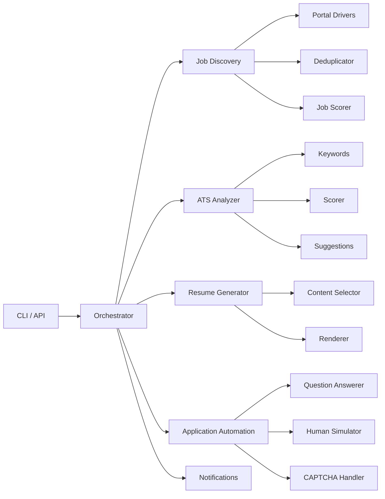

# ATS Optimizer — Implementation Walkthrough

## Summary

Built the complete ATS Optimizer system across **7 phases** with **154 passing tests**, **28 source files**, and a full CLI. The system automates job discovery, resume tailoring, ATS scoring, and application submission.

## Architecture



## Phases Completed

| Phase | Description | Key Files | Tests |
|-------|-------------|-----------|-------|
| 1 | Project Foundation | `config.py`, `database.py`, `models.py`, `schemas.py`, `main.py` | 21 |
| 2 | Candidate Profile | `profile/manager.py`, `profile/parser.py`, `candidate_profile.yaml` | 26 |
| 3 | ATS Analysis | `analyzer/keywords.py`, `analyzer/scorer.py`, `analyzer/suggestions.py`, `llm/provider.py` | 25 |
| 4 | Resume Generation | `generator/content_selector.py`, `generator/renderer.py`, `templates/classic.html` | 19 |
| 5 | Job Discovery | `drivers/base.py`, `drivers/linkedin.py`, `drivers/indeed.py`, `discovery/deduplicator.py`, `discovery/scorer.py` | 21 |
| 6 | Application Automation | `question_answerer.py`, `human_simulator.py`, `captcha_handler.py`, `orchestrator.py` | 23 |
| 7 | Dashboard & Polish | `notifications/notifier.py`, `cli.py` | 19 |

**Total: 154 tests passing**

## Test Results

```
tests/test_models.py      — 10 tests (Config, DB models, relationships)
tests/test_api.py          — 11 tests (FastAPI endpoints, CRUD, filters)
tests/test_profile.py      — 21 tests (Profile CRUD, parsing, accessors)
tests/test_analyzer.py     — 26 tests (Keywords, scoring, suggestions, LLM, API)
tests/test_generator.py    — 19 tests (Content selection, rendering, quality gate)
tests/test_discovery.py    — 21 tests (Drivers, dedup, job-profile scoring)
tests/test_automation.py   — 23 tests (Q&A answerer, CAPTCHA, orchestrator pipeline)
tests/test_final.py        — 23 tests (Notifications, CLI, end-to-end integration)
```

## Key Design Decisions

- **Modular architecture**: Each capability is a standalone module with clear interfaces
- **LLM abstraction**: `BaseLLMProvider` ABC with `StubProvider` allows running without API keys; real providers (Ollama, OpenAI, Gemini) pluggable later
- **Portal drivers as stubs**: `LinkedInDriver` and `IndeedDriver` return mock data; real Playwright automation swappable without changing pipeline
- **Keyword extraction without spaCy**: Regex + frequency analysis with skill alias normalization — lightweight, no heavy NLP dependency
- **5-component ATS scoring**: Keyword match (40%), section completeness (20%), keyword density (15%), experience relevance (15%), formatting (10%)
- **Jinja2 HTML templates**: ATS-friendly resume templates with optional WeasyPrint PDF output
- **Content selection by relevance**: Skills, bullets, and projects ranked by JD keyword overlap
- **Q&A bank with regex**: Application form answers matched via regex patterns from candidate profile
- **CAPTCHA detection, not solving**: Pauses and alerts user when CAPTCHA detected (V1 design choice)

## CLI Usage

```bash
# Search for jobs
python -m src.cli search --keywords python backend --location "San Francisco" --min-score 60

# View candidate profile
python -m src.cli profile --show

# Score resume against JD
python -m src.cli analyze --resume resume.txt --jd job_description.txt

# Full auto-apply pipeline
python -m src.cli search --keywords python --auto-apply --portals linkedin indeed
```

## What's Stubbed (Ready for Real Implementation)

| Component | Current State | To Make Real |
|-----------|--------------|--------------|
| LLM providers | `StubProvider` returns canned text | Add API keys, implement `OllamaProvider`/`OpenAIProvider`/`GeminiProvider` |
| LinkedIn driver | Mock data | Implement Playwright login + Easy Apply flow |
| Indeed driver | Mock data | Implement Playwright search + apply flow |
| Email notifications | Logs instead of sending | Configure SMTP credentials |
| PDF generation | HTML only (WeasyPrint optional) | `pip install weasyprint` |
